# G-NESTING — MANUAL DO USUÁRIO

Objetos que transformam espaços.

Versão 1.0 · 27 de setembro de 2026 · corresponde ao sistema G-Nesting da etapa 14 (loja, painel e aplicativo no celular).

---

# 1. Apresentação

## 1.1 O que é o G-Nesting

O G-Nesting é o sistema da loja virtual G-Nesting: uma loja de objetos de design em MDF e madeira (relógios, painéis, organizadores, presentes), produzidos no próprio ateliê por corte CNC ou laser e acabados à mão.

O sistema tem duas partes que trabalham juntas:

- **A loja**, aberta a qualquer pessoa na internet. É onde o cliente conhece os produtos, personaliza, compra, paga e acompanha o pedido.
- **O painel**, de acesso restrito à equipe. É onde a loja é administrada: catálogo, pedidos, produção no ateliê, estoque, expedição, clientes, relatórios e configurações.

O que diferencia o G-Nesting de uma loja comum é que ele acompanha o produto **da compra até a oficina**: cada pedido pago vira uma ordem de produção, com a ficha técnica da peça (material, corte, programa CNC, etapas e tempos), e passa pela fila de produção até a embalagem e o envio.

## 1.2 Para quem é este manual

Este manual é para quem **usa** o sistema no dia a dia, sem precisar de conhecimento técnico:

| Leitor | O que vai encontrar |
|---|---|
| Cliente da loja | Como criar a conta, comprar, pagar, acompanhar o pedido e usar os favoritos (capítulos 3 a 9) |
| Proprietário da loja | Tudo: catálogo, vendas, produção, equipe, relatórios, configurações e sistema |
| Gestor | Catálogo, pedidos, clientes, cupons, relatórios, produção, estoque e expedição |
| Equipe de produção | Fichas de produção, fila de produção, estoque, matérias-primas e expedição (capítulos 14 a 16) |
| Atendimento | Consulta de pedidos e clientes, mensagens e notas (capítulos 17 e 18) |

A instalação na hospedagem, o banco de dados e a configuração técnica (arquivo `.env`, cron, domínio) **não** fazem parte deste manual. Estão no *Guia de instalação e uso*, que acompanha o pacote de instalação.

## 1.3 Como este manual está organizado

- **Capítulos 2 a 9:** a loja, do ponto de vista de quem compra.
- **Capítulos 10 a 24:** o painel, módulo por módulo, na ordem do menu.
- **Capítulos 25 a 32:** procedimentos passo a passo, solução de problemas, boas práticas, glossário, perguntas frequentes, fluxos, mapa do sistema e índice remissivo.

Cada tela importante aparece numa **figura real** do sistema, com **marcadores numerados**. Logo abaixo da figura, cada número é explicado.

As telas mostram a loja com os **dados de demonstração** que acompanham o sistema (produtos, clientes e pedidos fictícios, com nomes como "Diego Barbosa" e "Porta-Chaves Minimalista"). Na sua loja, os nomes, valores e quantidades serão os seus.

## 1.4 Convenções

**Perfis.** No início de cada tela ou tarefa, a linha **Perfil** diz quem pode usá-la:

| Perfil | Quem é |
|---|---|
| VISITANTE | Qualquer pessoa na loja, sem ter entrado numa conta |
| CLIENTE | Pessoa que criou conta na loja e entrou com e-mail e senha |
| PROPRIETÁRIO | Dono da loja no painel: acesso a tudo. É o que costuma se chamar de "administrador" |
| GESTOR | Equipe de gestão: catálogo, vendas, produção e relatórios |
| PRODUÇÃO | Equipe da oficina: fichas, fila de produção, estoque e expedição |
| ATENDIMENTO | Equipe de atendimento: consulta de pedidos e clientes, mensagens |

O proprietário pode fazer tudo o que os outros perfis do painel fazem. Quando a linha diz "GESTOR", entenda "GESTOR e PROPRIETÁRIO".

**Caixas de destaque:**

> **IMPORTANTE:** regra do sistema que, se ignorada, impede a tarefa ou causa um resultado diferente do esperado.

> **ATENÇÃO:** ação que não pode ser desfeita ou que afeta clientes, dinheiro ou estoque.

> **DICA:** forma mais rápida ou segura de fazer algo.

> **OBSERVAÇÃO:** informação complementar, limite ou comportamento que vale conhecer.

**Nomes de botões e campos** aparecem em **negrito**, exatamente como estão na tela. Endereços de páginas aparecem assim: `/admin/pedidos`. O endereço completo é o do seu domínio seguido desse caminho, por exemplo `https://sualoja.com.br/admin/pedidos`.

**Recursos parciais.** Quando algo existe só em parte, ou não existe, o manual diz isso claramente, para você não procurar uma função que o sistema não tem.

---

# 2. Conhecendo o G-Nesting

## 2.1 A loja e o painel

| | Loja | Painel |
|---|---|---|
| Endereço | a raiz do domínio, `/` | `/admin` |
| Quem usa | visitantes e clientes | equipe (usuários do painel) |
| Como entrar | não precisa entrar para comprar; a conta é opcional | e-mail e senha criados pelo proprietário |
| No celular | funciona no navegador e pode ser instalada como aplicativo | também funciona no celular e pode ser instalado como aplicativo separado |

As contas da loja e as do painel são **separadas**: um cliente não entra no painel, e um usuário do painel não usa a mesma conta para comprar.

## 2.2 O caminho de um pedido

O sistema foi feito em torno deste caminho, do clique do cliente até a entrega:

1. O cliente escolhe o produto, a variação (ex.: tamanho, acabamento) e, se o produto permitir, a personalização (ex.: nome gravado).
2. No carrinho, confere os itens e aplica um cupom, se tiver.
3. Na finalização, informa os dados, o endereço e escolhe o frete.
4. Paga no ambiente do Mercado Pago (Pix, cartão ou boleto).
5. Com o pagamento aprovado, o pedido vai sozinho para a **fila de produção**.
6. A oficina produz a peça etapa por etapa (CNC, lixamento, pintura, secagem, montagem, controle de qualidade, embalagem).
7. A expedição despacha com o código de rastreio; o cliente recebe o aviso por e-mail.
8. A entrega é registrada e o pedido é concluído.

O cliente acompanha cada passo na página do pedido. A equipe acompanha tudo no painel. O capítulo 30 mostra esse fluxo em detalhe.

## 2.3 Produtos sob pedido e de pronta entrega

Cada variação de produto trabalha num de dois modos:

| Modo | Como funciona |
|---|---|
| **Produzido sob pedido** | A peça só é feita depois do pagamento. Não há quantidade em estoque; a loja mostra o prazo de produção ("Produzido em até 3 dias úteis"). É o modo padrão. |
| **Pronta entrega** | A peça já está pronta na prateleira. O sistema controla a quantidade: o que está em pedidos não pagos fica reservado, e quando acaba a loja mostra "esgotado". |

## 2.4 Perfis e permissões em resumo

| O que | Visitante | Cliente | Proprietário | Gestor | Produção | Atendimento |
|---|---|---|---|---|---|---|
| Ver produtos e comprar | sim | sim | — | — | — | — |
| Favoritos e histórico de pedidos na conta | — | sim | — | — | — | — |
| Visão geral do painel | — | — | sim | sim | sim | sim |
| Produtos, categorias, cupons, relatórios | — | — | sim | sim | — | — |
| Fichas, matérias-primas, fila de produção, estoque, expedição | — | — | sim | sim | sim | — |
| Pedidos | — | — | sim | sim | consulta, notas e envio | consulta, notas e mensagens |
| Clientes | — | — | sim | sim | — | sim (CPF parcial) |
| Configurações, usuários, auditoria, sistema | — | — | sim | — | — | — |

O capítulo 20 detalha cada permissão.

## 2.5 O que o sistema não tem

Para não haver dúvida, estas funções **não existem** nesta versão:

- **Avaliações de produtos** pelos clientes (estrelas, comentários).
- **Edição do perfil pelo cliente**: o cliente não altera nome, e-mail nem senha pela área do cliente. A senha só muda por **Esqueci minha senha**.
- **Página de endereços** na área do cliente: endereços são salvos durante a compra, marcando **Salvar este endereço na minha conta**, e não podem ser editados nem apagados pelo cliente.
- **Cancelamento do pedido pelo cliente**: o cliente pede o cancelamento ao atendimento; quem cancela é a equipe no painel.
- **Emissão de nota fiscal** e **geração de etiqueta de frete** pelas transportadoras: são feitas fora do sistema. O sistema registra a transportadora e o código de rastreio.
- **Cálculo de frete pelos Correios em tempo real**: o frete vem de uma **tabela por região** mantida pela loja (capítulo 22).

---

# 3. Conta do cliente

**Perfil:** VISITANTE · CLIENTE

A conta é **opcional**. Qualquer pessoa pode comprar sem criar conta: basta informar o e-mail na finalização da compra. A conta serve para:

- ver todos os pedidos num só lugar (**Meus pedidos**);
- guardar produtos nos **Favoritos**;
- reaproveitar endereços de entrega em compras seguintes;
- ter o nome e o e-mail preenchidos na finalização.

## 3.1 Criar conta

1. No topo da loja, clique em **Entrar** (ícone de pessoa) e depois em **Criar conta**. No celular, o botão **Criar conta** também está no menu ☰.
2. Preencha o formulário da figura 3.1.
3. Clique em **Criar conta**. Você já entra logado.

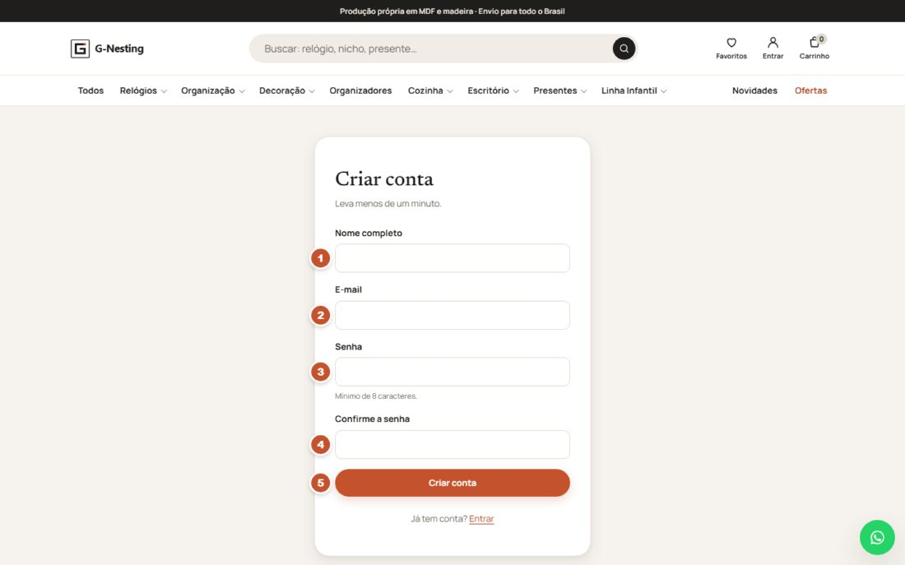

1. **Nome completo**: como você quer ser chamado nos e-mails e nos pedidos.
2. **E-mail**: será o seu login. Cada e-mail só pode ter uma conta.
3. **Senha**: no mínimo 8 caracteres.
4. **Confirme a senha**: digite a mesma senha de novo.
5. **Criar conta**: cria a conta e entra.

> **OBSERVAÇÃO:** pedidos feitos antes, sem conta, com o mesmo e-mail, continuam acompanhados pelo link enviado por e-mail na época da compra.

## 3.2 Entrar na conta

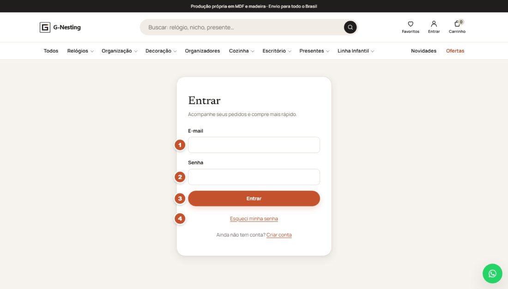

1. **E-mail** da conta.
2. **Senha**.
3. **Entrar**.
4. **Esqueci minha senha**: abre a recuperação de senha (seção 3.3). Abaixo, **Criar conta** leva ao cadastro.

Se o e-mail ou a senha estiverem errados, aparece "E-mail ou senha inválidos." Por segurança, a mensagem não diz qual dos dois está errado.

> **ATENÇÃO:** depois de **5 tentativas erradas em 15 minutos**, o login fica bloqueado por alguns minutos e aparece "Muitas tentativas. Tente novamente em X minutos." Espere o tempo indicado ou use **Esqueci minha senha**.

Para sair, use **Sair da conta** na área do cliente ou **Sair** no menu ☰ do celular.

## 3.3 Esqueci minha senha

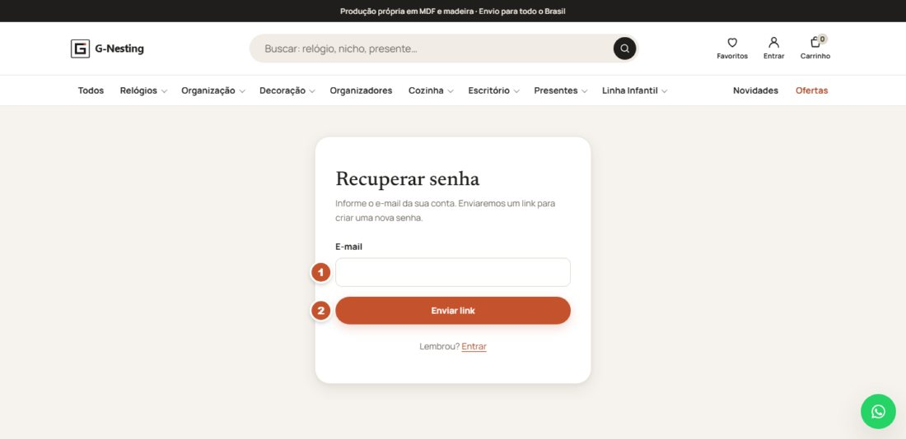

1. **E-mail** da conta.
2. **Enviar link**: se o e-mail tiver conta, chega uma mensagem com um link para criar uma nova senha.

Passo a passo:

1. Na tela **Entrar**, clique em **Esqueci minha senha**.
2. Informe o e-mail e clique em **Enviar link**.
3. Abra o e-mail e clique no link. Ele vale por **60 minutos** e só pode ser usado uma vez.
4. Digite a **Nova senha** (mínimo de 8 caracteres), repita em **Confirme a nova senha** e clique em **Salvar nova senha**.

> **OBSERVAÇÃO:** por segurança, a tela mostra a mesma mensagem de confirmação exista ou não uma conta com aquele e-mail. Se o e-mail não chegar em alguns minutos, confira a caixa de spam e se o e-mail digitado é o da conta. São permitidos poucos pedidos de link por hora para o mesmo e-mail.

> **IMPORTANTE:** ao salvar a nova senha, as sessões abertas em outros aparelhos são encerradas. Em cada aparelho será preciso entrar de novo.

## 3.4 Tempo de sessão

Por segurança, a sessão expira depois de um tempo sem uso (na configuração padrão, 2 horas). Basta entrar de novo. O **carrinho não se perde** quando a sessão expira: ele fica guardado no navegador por 30 dias (capítulo 6).

---

# 4. Navegação na loja

**Perfil:** VISITANTE · CLIENTE

## 4.1 Página inicial

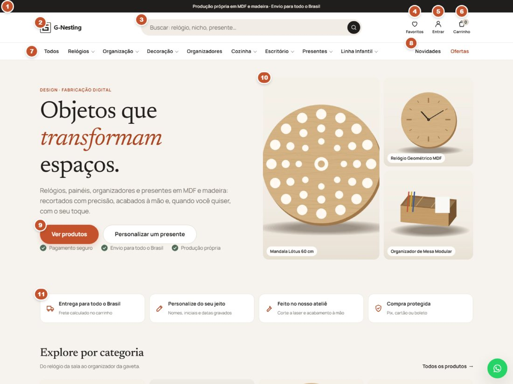

1. **Faixa de avisos**: uma linha de recado da loja (ex.: prazos, promoções). É configurada no painel (seção 22.1) e some quando fica vazia.
2. **Logotipo**: em qualquer página, volta à página inicial.
3. **Busca**: procure pelo nome do produto, por palavras da descrição, por palavras-chave cadastradas ou pelo código (SKU). Digite pelo menos 2 letras e tecle Enter.
4. **Favoritos**: os produtos marcados com o coração. O número mostra quantos são (só com conta).
5. **Entrar / Olá, nome**: leva ao login ou, se você já entrou, à sua conta.
6. **Carrinho**: o número mostra quantos itens há no carrinho.
7. **Menu de categorias**: **Todos** e as categorias principais. Passe o mouse sobre uma categoria com seta para ver as subcategorias.
8. **Novidades** e **Ofertas**: **Novidades** mostra todos os produtos, dos mais recentes para os mais antigos; **Ofertas**, os produtos com preço promocional.
9. **Ver produtos** e **Personalizar um presente**: levam ao catálogo completo e aos produtos personalizáveis.
10. **Destaques**: fotos de produtos escolhidos pela loja; clique para abrir o produto.
11. **Faixa de garantias**: entrega para todo o Brasil, personalização, produção própria e compra protegida.

Descendo a página, a loja mostra, nesta ordem: **Explore por categoria**, **Destaques da semana**, **Ofertas**, **Presente com significado** (produtos personalizáveis), **Mais vendidos**, **Novidades** (produtos marcados como lançamento) e **Como fazemos**. Uma seção sem produtos simplesmente não aparece.

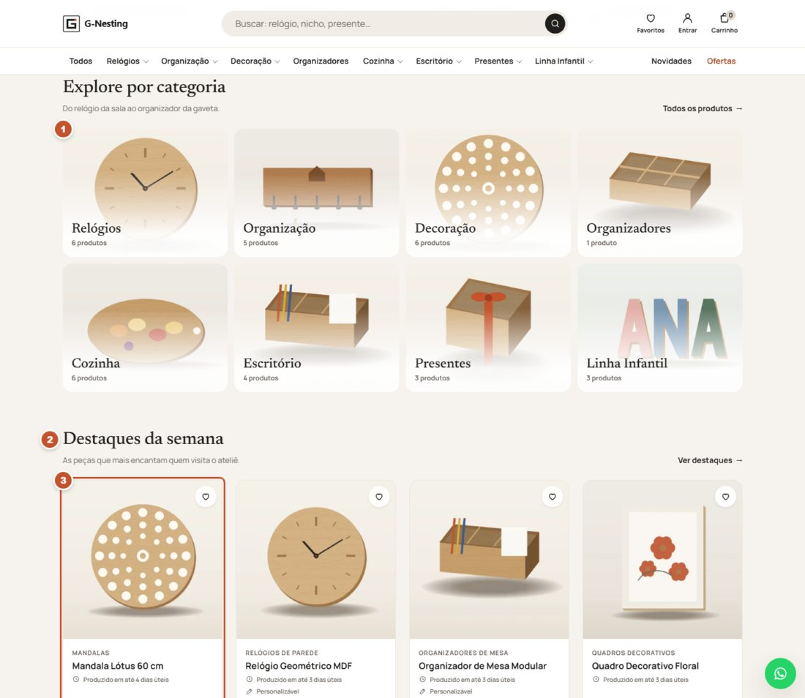

1. **Explore por categoria**: cada cartão abre uma categoria principal e mostra quantos produtos ela tem. A foto é a do produto mais vendido da categoria.
2. **Destaques da semana**: produtos marcados como destaque no painel. **Ver destaques** abre a lista completa.
3. **Cartão de produto**: explicado na seção 4.5.

## 4.2 Rodapé

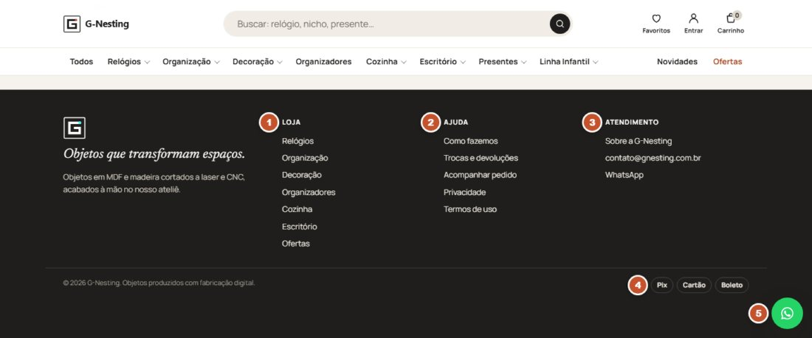

1. **Loja**: atalhos para as categorias principais e para as **Ofertas**.
2. **Ajuda**: **Como fazemos**, **Trocas e devoluções**, **Acompanhar pedido**, **Privacidade** e **Termos de uso**.
3. **Atendimento**: **Sobre a G-Nesting**, o e-mail de contato e o **WhatsApp** (quando configurados).
4. **Formas de pagamento** aceitas: Pix, cartão e boleto.
5. **Botão do WhatsApp**: quando o proprietário ativa o botão flutuante, ele aparece em todas as páginas. Abre uma conversa com a loja já com uma mensagem inicial.

> **OBSERVAÇÃO:** no celular e no computador com Chrome ou Edge, o rodapé pode mostrar também a caixa **Aplicativo**, com o botão **Instalar o aplicativo** (seção 4.8). Ela só aparece quando o navegador permite a instalação.

## 4.3 No celular

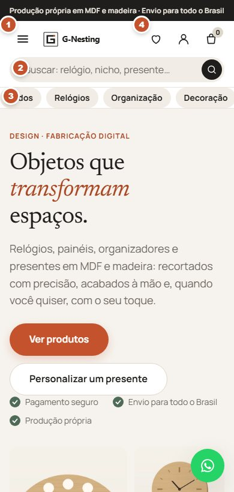

1. **Menu ☰**: abre a lista de categorias e os atalhos da conta (figura 4.5).
2. **Busca**, sempre visível abaixo do logotipo.
3. **Faixa de categorias**: deslize para o lado para ver **Todos**, as categorias principais, **Ofertas** e **Novidades**. Na página de uma categoria, o botão dela fica marcado.
4. **Favoritos, conta e carrinho**.

O cabeçalho, com a busca e a faixa de categorias, fica preso no topo enquanto você rola a página. No celular, a seção "Explore por categoria" da página inicial não aparece, porque a faixa de categorias cumpre esse papel.

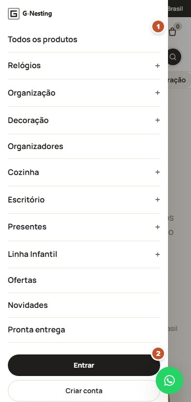

1. **Categorias**: toque no **+** para ver as subcategorias. No fim, **Ofertas**, **Novidades** e **Pronta entrega**.
2. **Conta**: **Entrar** e **Criar conta** (ou **Minha conta** e **Sair**, se você já entrou). Quando o celular permite, aparece também **Instalar o aplicativo**.

## 4.4 Catálogo, categorias e filtros

Ao abrir uma categoria, **Todos**, **Ofertas**, **Novidades** ou uma busca, a loja mostra a lista de produtos com filtros.

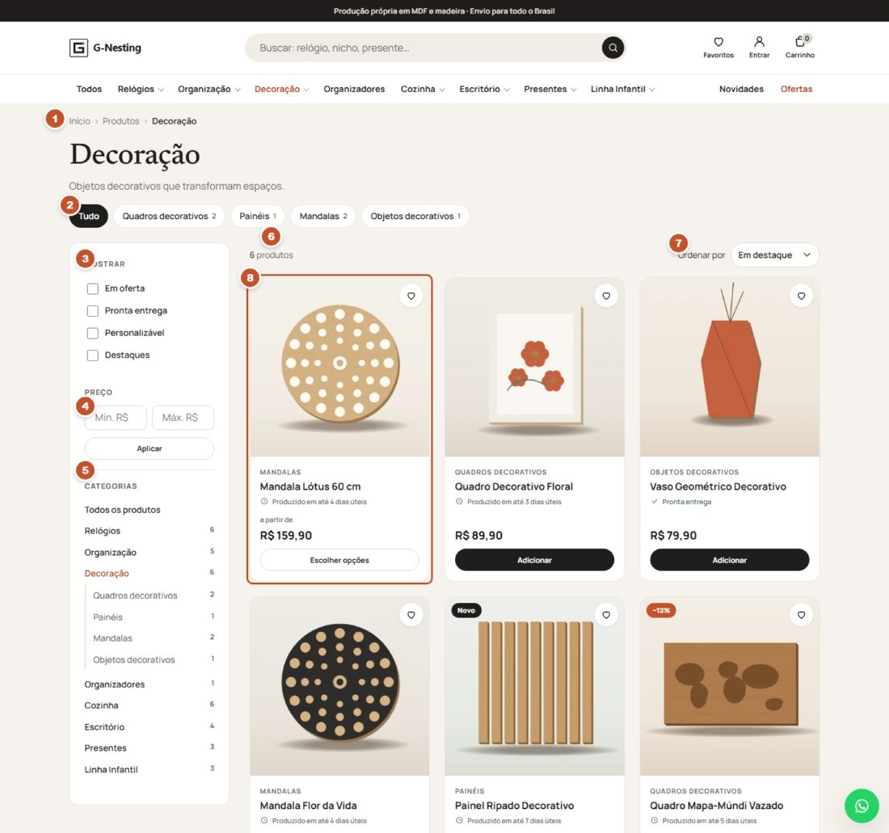

1. **Trilha**: mostra onde você está (Início › Produtos › Categoria). Clique num nível para voltar.
2. **Subcategorias**: **Tudo** e as subcategorias, com a quantidade de produtos de cada uma.
3. **Mostrar**: filtros rápidos. Marque um ou mais:
   - **Em oferta**: produtos com preço promocional;
   - **Pronta entrega**: produtos com unidades prontas para envio;
   - **Personalizável**: produtos que aceitam nome, inicial, data ou opção;
   - **Destaques**: produtos escolhidos pela loja.
4. **Preço**: informe um valor mínimo, máximo ou os dois e clique em **Aplicar**.
5. **Categorias**: todas as categorias, com a quantidade de produtos. A atual fica marcada.
6. **Quantidade** de produtos encontrados.
7. **Ordenar por**: **Em destaque** (na busca, **Mais relevantes**), **Novidades**, **Menor preço**, **Maior preço** e **Mais vendidos**.
8. **Produtos**: 12 por página. No fim da lista aparecem os números das páginas.

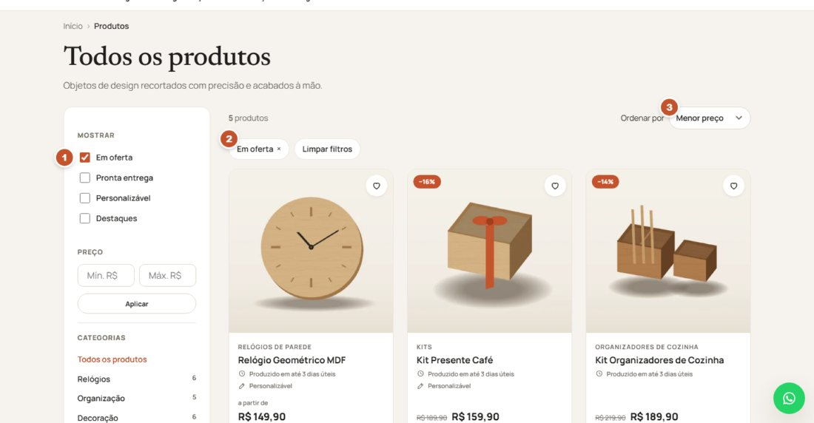

1. Filtro **Em oferta** marcado.
2. **Filtros ativos**: cada filtro aparece como uma etiqueta; clique no **×** para retirá-lo, ou em **Limpar filtros** para retirar todos.
3. Ordenação escolhida (**Menor preço**).

> **DICA:** o endereço da página guarda os filtros. Você pode copiar o link de uma lista filtrada (ex.: ofertas por menor preço) e enviar a alguém.

## 4.5 O cartão de produto

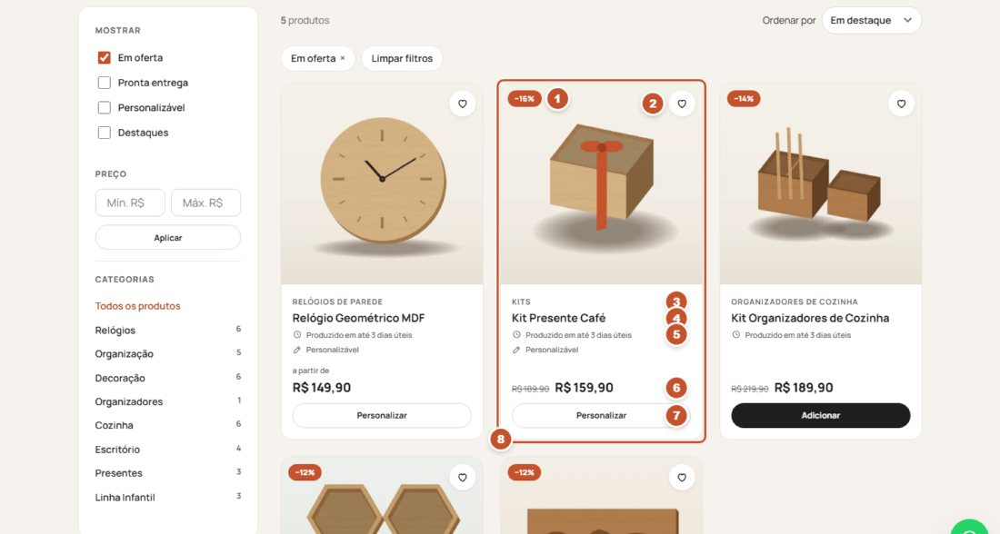

1. **Selo**: **-16%** mostra o desconto em relação ao preço "de"; **Novo** marca lançamentos.
2. **Coração (favoritar)**: guarda o produto nos seus favoritos; clique de novo para retirar. Sem conta, a loja pede para entrar ou criar uma e, depois, volta ao produto.
3. **Categoria** do produto.
4. **Nome** do produto: abre a página do produto.
5. **Prazo e características**: "Produzido em até N dias úteis" (sob pedido), "Pronta entrega" ou "Esgotado", e "Personalizável".
6. **Preço**: o preço "de" riscado (quando há promoção) e o preço atual. "a partir de" indica que há variações com preços diferentes.
7. **Botão**:
   - **Adicionar**: põe 1 unidade no carrinho direto, quando o produto tem uma só versão e nada para escolher;
   - **Escolher opções**: abre o produto para escolher a variação;
   - **Personalizar**: abre o produto para preencher a personalização.
8. O cartão inteiro, com a foto, também abre o produto.

## 4.6 Busca

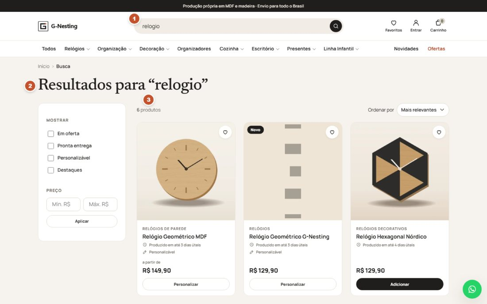

1. O que foi digitado continua na caixa de busca.
2. **Resultados para "…"**.
3. Quantidade de produtos encontrados. Os filtros e a ordenação funcionam como no catálogo.

A busca procura no nome, na descrição, nas palavras-chave cadastradas pela loja e no código (SKU). Não diferencia maiúsculas, minúsculas nem acentos: "relogio" encontra "Relógio".

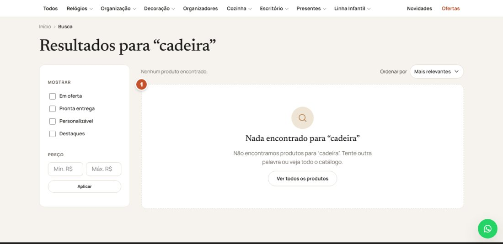

1. Quando nada é encontrado, a loja sugere tentar outra palavra e oferece **Ver todos os produtos**.

> **DICA:** se a busca não encontrar o que você quer, tente uma palavra mais curta ou mais geral ("nicho" em vez de "nicho hexagonal grande") ou navegue pela categoria.

## 4.7 Páginas institucionais

Pelo rodapé:

| Página | Conteúdo |
|---|---|
| **Sobre a G-Nesting** | a marca e a origem do nome |
| **Como fazemos** | as etapas de produção e como funcionam os prazos |
| **Trocas e devoluções** | direito de arrependimento (7 dias), personalizados, defeitos (90 dias) e como solicitar |
| **Privacidade** | dados coletados, cookies e direitos do titular (LGPD) |
| **Termos de uso** | condições de compra |

## 4.8 Instalar a loja no celular (aplicativo)

A loja pode ser instalada como um aplicativo: um ícone na tela inicial que abre em tela cheia, sem a barra do navegador.

- **Android (Chrome, Edge, Samsung Internet):** toque em **Instalar o aplicativo**, no rodapé ou no menu ☰. Se o botão não aparecer, use o menu do navegador (⋮) → **Instalar app** ou **Adicionar à tela inicial**.
- **iPhone (Safari):** toque em **Compartilhar** (quadrado com seta) → **Adicionar à Tela de Início**. A loja mostra essa instrução quando é aberta no iPhone.
- **Computador (Chrome ou Edge):** use o ícone de instalar na barra de endereço.

Segure o ícone do aplicativo por um instante para ver os atalhos **Meus pedidos**, **Carrinho** e **Favoritos**.

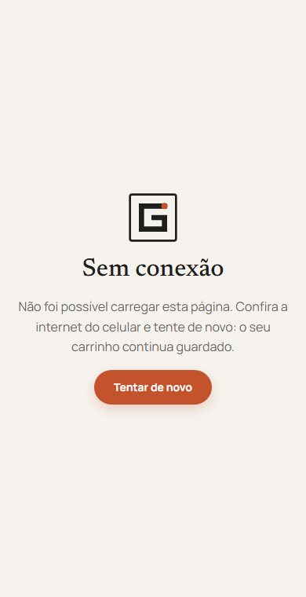

Sem internet, o aplicativo mostra a página **Sem conexão**, com o botão **Tentar de novo**. Nenhuma página com dados pessoais (conta, carrinho, pedido) fica guardada no aparelho.

> **OBSERVAÇÃO:** a instalação só funciona com a loja publicada em endereço seguro (**https**). O aplicativo é a própria loja: tudo o que muda no painel aparece nele na hora.

---

# 5. Página do produto

**Perfil:** VISITANTE · CLIENTE

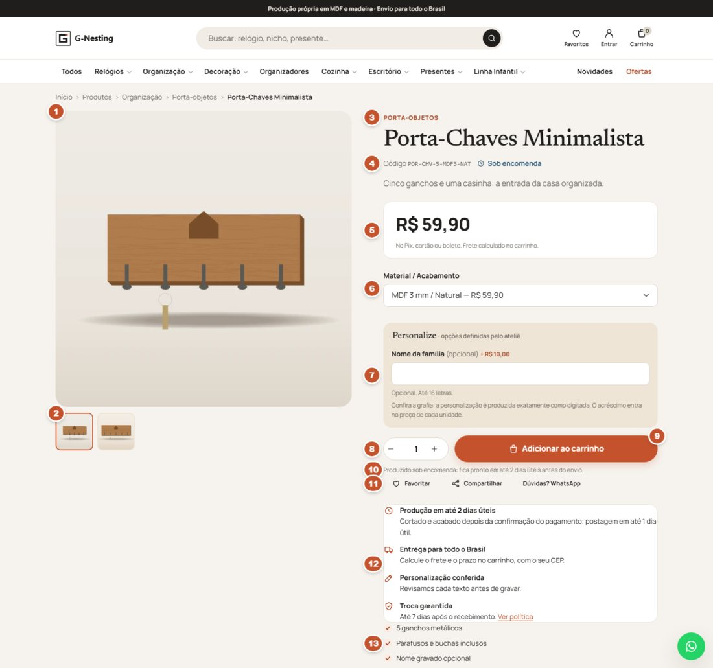

1. **Foto principal**. Clique nas miniaturas para trocar de foto.
2. **Miniaturas** de todas as fotos do produto.
3. **Categoria** do produto; clique para ver os outros produtos dela.
4. **Código** (SKU) da versão escolhida e o modo de produção: **Sob encomenda**, **Pronta entrega** ou **Esgotado**.
5. **Preço** da versão escolhida. Quando há promoção, o preço "de" aparece riscado com o desconto.
6. **Variação** (aqui, "Material / Acabamento"): escolha a versão. O preço, o código, as medidas e a disponibilidade mudam na hora. Versões esgotadas aparecem com "(esgotado)".
7. **Personalize**: campos que a loja definiu para este produto (nome, inicial, data ou uma opção da lista). Campos com "(opcional)" podem ficar em branco. O acréscimo de preço aparece ao lado do nome do campo (ex.: **+ R$ 10,00**).
8. **Quantidade**: use **−** e **+** ou digite o número.
9. **Adicionar ao carrinho**.
10. **Disponibilidade**: prazo de produção (sob encomenda) ou quantas unidades restam (pronta entrega, quando são 5 ou menos).
11. **Favoritar**, **Compartilhar** (no celular abre o menu de compartilhamento; no computador copia o link) e **Dúvidas? WhatsApp** (abre uma conversa com a loja já citando o produto).
12. **Informações de entrega**: prazo de produção e de postagem, entrega para todo o Brasil, personalização conferida e troca garantida.
13. **Características** do produto, uma por linha.

Mais abaixo:

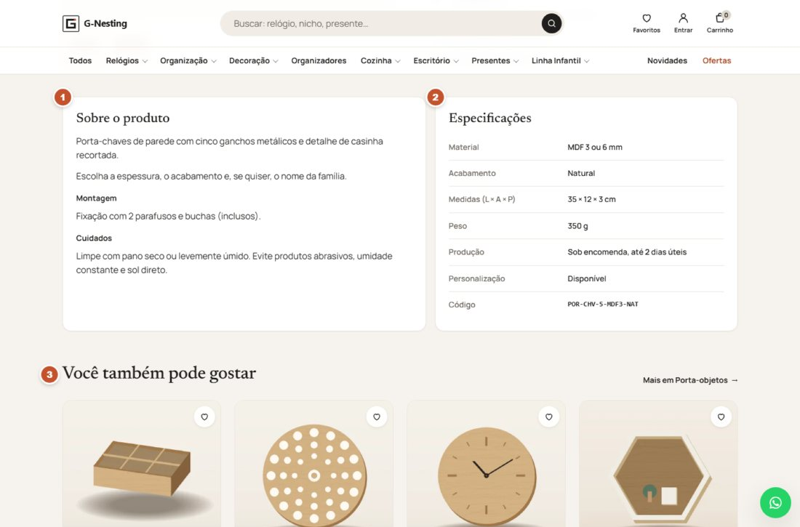

1. **Sobre o produto**: descrição, **Montagem** e **Cuidados**.
2. **Especificações**: material, acabamento, medidas (L × A × P), peso, produção, personalização e código.
3. **Você também pode gostar**: produtos da mesma categoria. **Mais em …** abre a categoria.

## 5.1 Como comprar um produto

1. Escolha a **variação**, se houver.
2. Preencha a **personalização**, se quiser (ou se ela for obrigatória).
3. Ajuste a **quantidade**.
4. Clique em **Adicionar ao carrinho**. A loja abre o carrinho com a mensagem "Produto adicionado ao carrinho."

> **IMPORTANTE:** a personalização é produzida **exatamente como digitada**. Confira letra por letra, acentos e maiúsculas antes de adicionar ao carrinho. A loja revisa o texto antes de gravar, mas não corrige a grafia.

## 5.2 Regras da personalização

Cada campo tem regras definidas pela loja. Se algo não for aceito, a mensagem aparece embaixo do campo e o produto não entra no carrinho.

| Tipo de campo | O que aceita |
|---|---|
| **Texto curto** (ex.: nome gravado) | entre um mínimo e um máximo de caracteres; conforme o campo, só letras e espaços, letras e números, ou também pontuação simples |
| **Inicial** | de 1 a 3 letras |
| **Data** | uma data válida (ex.: data de casamento) |
| **Opção pré-definida** (ex.: fonte, cor) | uma das opções da lista; algumas opções têm acréscimo de preço |

A instrução embaixo de cada campo explica o limite (ex.: "Opcional. Até 16 letras.").

> **OBSERVAÇÃO:** o acréscimo da personalização é cobrado **por unidade**. Duas unidades com nome gravado de + R$ 10,00 somam + R$ 20,00.

## 5.3 Produto esgotado

Quando uma versão de pronta entrega acaba, aparece **Produto esgotado no momento** e o botão de compra fica indisponível para ela. Outras versões do mesmo produto podem continuar disponíveis: troque a variação.

---

# 6. Carrinho

**Perfil:** VISITANTE · CLIENTE

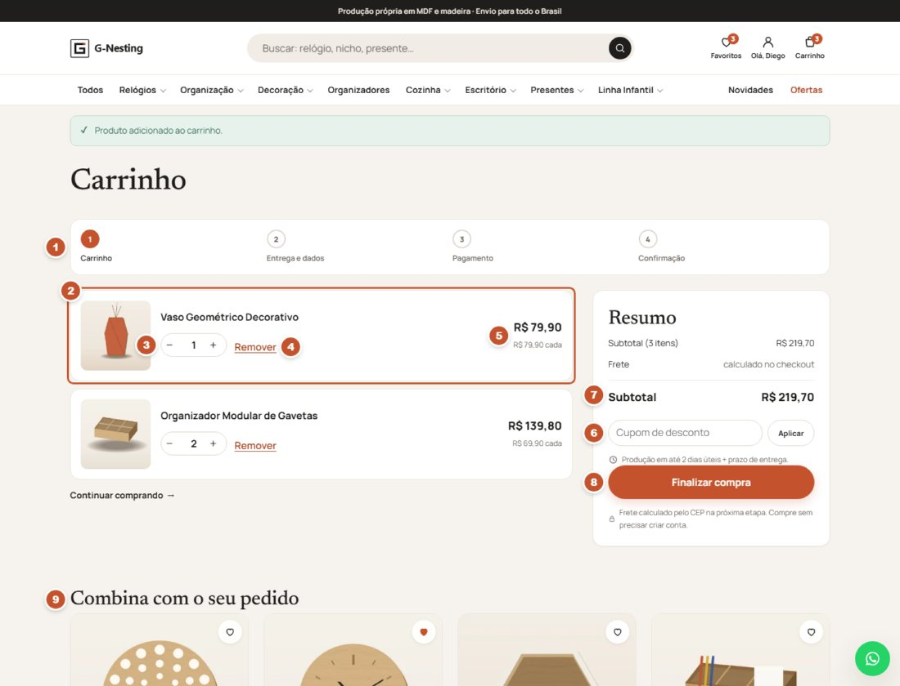

1. **Etapas da compra**: Carrinho → Entrega e dados → Pagamento → Confirmação.
2. **Item**: foto, nome, variação e personalização escolhidas.
3. **Quantidade**: use **−** e **+**. A alteração é salva sozinha.
4. **Remover**: tira o item do carrinho.
5. **Preço** do item (quantidade × preço unitário, com a personalização) e o preço de cada unidade.
6. **Cupom de desconto**: digite o código e clique em **Aplicar**.
7. **Subtotal** dos produtos, já com o desconto do cupom. O frete é calculado na próxima etapa.
8. **Finalizar compra**: vai para a entrega e os dados.
9. **Combina com o seu pedido**: sugestões de outros produtos.

## 6.1 Regras do carrinho

- Até **99 unidades** de cada item e até **30 itens diferentes** por carrinho.
- Em produtos de **pronta entrega**, a quantidade é limitada ao que está disponível: "Temos apenas N unidade(s) disponível(is) deste produto."
- O carrinho fica guardado **neste navegador por 30 dias**, contados da última alteração. Não é preciso ter conta. Em outro navegador ou aparelho, o carrinho é outro.
- O **prazo** do carrinho é o do item mais demorado: "Produção em até N dias úteis + prazo de entrega."
- Se um produto deixou de ser vendido ou esgotou depois de entrar no carrinho, ele aparece destacado como **Produto indisponível**, com a mensagem "Ajuste os itens destacados para continuar." Remova-o ou diminua a quantidade para poder finalizar.

## 6.2 Cupom de desconto

- Um cupom por compra. Para trocar, clique em **Remover cupom** e aplique o outro.
- O desconto aparece no resumo como **Cupom CÓDIGO** e é descontado do subtotal. Cupom de **frete grátis** aparece como benefício e zera o frete mais econômico na finalização.
- Mensagens possíveis:

| Mensagem | Significado |
|---|---|
| Cupom não encontrado. Confira o código. | o código não existe (maiúsculas e minúsculas tanto faz) |
| O cupom … não está válido no momento. | cupom desativado, ainda não começou ou já terminou |
| O cupom … já foi totalmente utilizado. | atingiu o limite de usos |
| O cupom … vale para compras a partir de R$ … | o subtotal é menor que a compra mínima |
| Você já usou o cupom … o máximo de vezes permitido. | limite de usos por cliente (conferido pelo e-mail na finalização) |

> **OBSERVAÇÃO:** por segurança, depois de muitas tentativas de códigos errados em poucos minutos, a loja bloqueia novas tentativas por um tempo.

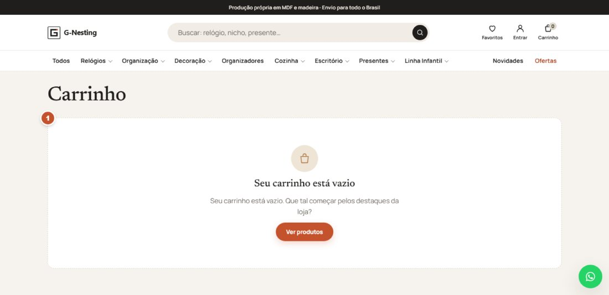

1. Com o carrinho vazio, a loja oferece **Ver produtos**.

---

# 7. Finalização da compra

**Perfil:** VISITANTE · CLIENTE

Na finalização, você informa seus dados, o endereço e escolhe o frete. **Não é preciso ter conta**: quem não entrou informa também o e-mail, para onde vão a confirmação e o link do pedido. Quem já tem conta pode clicar em **Entre** no topo da página para usar os endereços salvos.

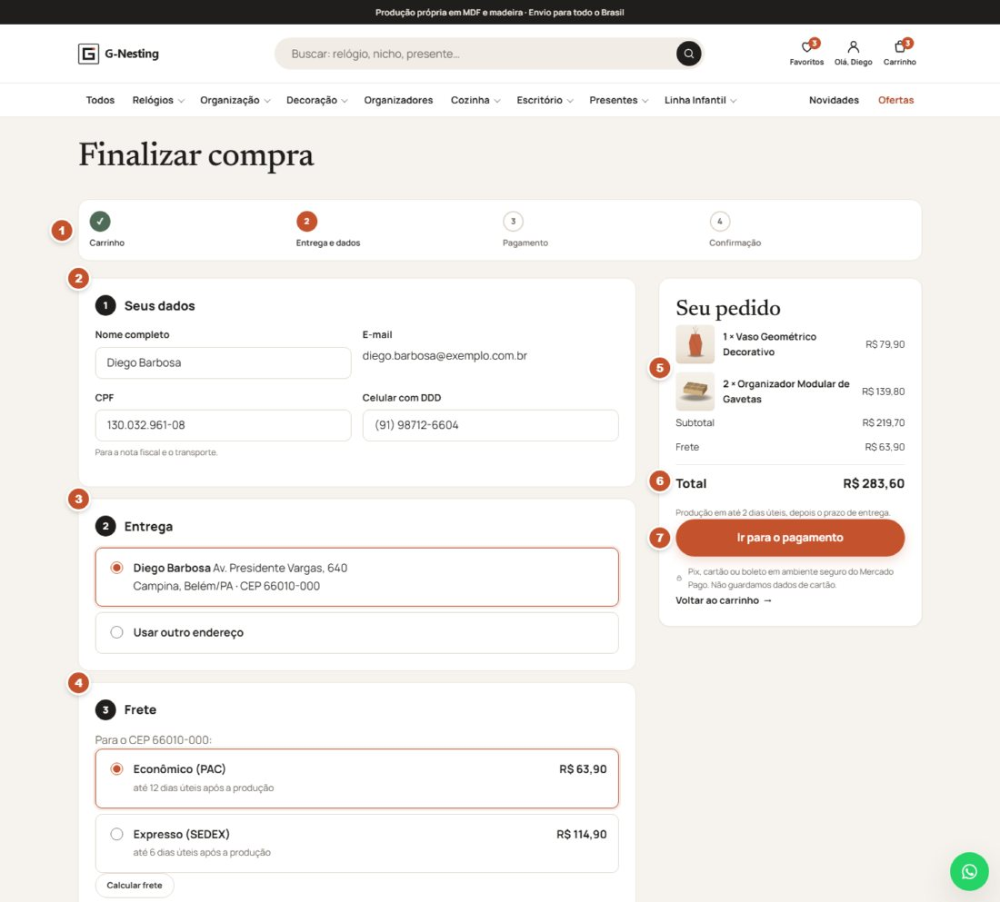

1. **Etapas**: você está em **Entrega e dados**.
2. **Seus dados**: **Nome completo**, **E-mail** (para quem entrou, é o da conta e não muda aqui), **CPF** ("Para a nota fiscal e o transporte") e **Celular com DDD**.
3. **Entrega**: escolha um endereço salvo ou **Usar outro endereço** (figura 7.2).
4. **Frete**: as opções para o CEP, com preço e prazo. Escolha uma.
5. **Seu pedido**: itens, subtotal, cupom e frete.
6. **Total** a pagar.
7. **Ir para o pagamento**: registra o pedido e abre o pagamento.

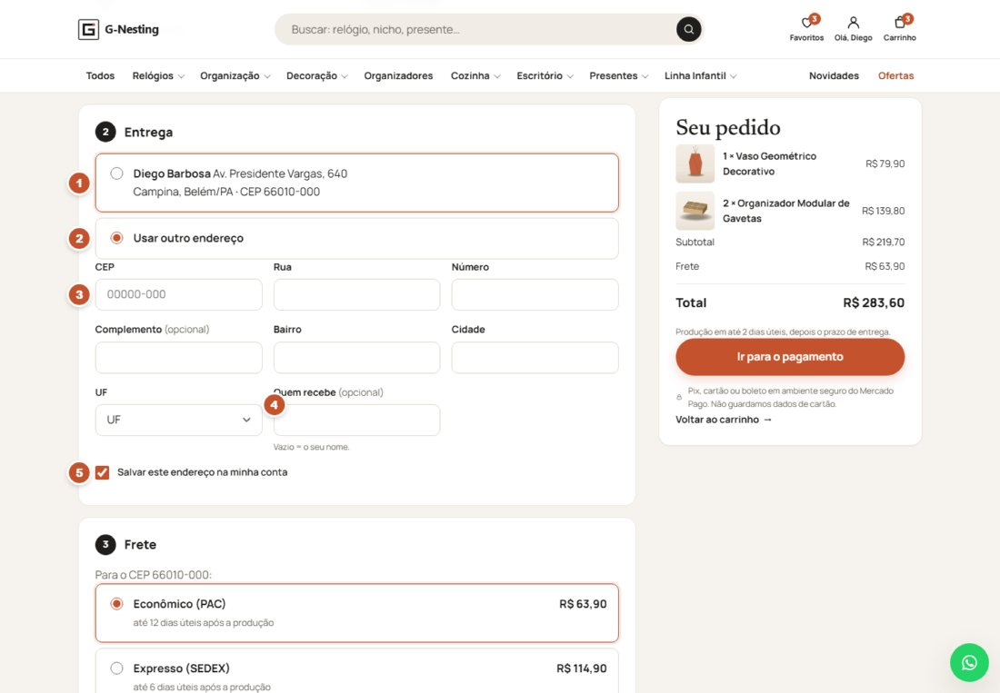

1. **Endereço salvo** na conta (aparece para quem entrou e já salvou endereços).
2. **Usar outro endereço**: abre o formulário.
3. **CEP**: ao preencher, as opções de frete são atualizadas. Depois preencha **Rua**, **Número**, **Complemento** (opcional), **Bairro**, **Cidade** e **UF**.
4. **Quem recebe**: nome de quem vai receber a encomenda. Vazio = o seu nome.
5. **Salvar este endereço na minha conta** (só para quem entrou): guarda o endereço para as próximas compras.

## 7.1 Frete

- As opções vêm da **tabela de frete da loja**, por região do CEP: normalmente **Econômico (PAC)** e **Expresso (SEDEX)**. Se a loja ativar, aparece também **Retirada no ateliê** ("combine a retirada após a produção").
- O prazo do frete conta **depois da produção**: "até 12 dias úteis após a produção". O prazo total é produção + entrega.
- Se o CEP mudar e as opções não se atualizarem, clique em **Calcular frete**.
- Se aparecer "Não entregamos neste CEP pelas opções automáticas. Fale com a gente.", a tabela da loja não cobre aquela região: fale com o atendimento.
- Cupom de frete grátis zera a opção mais econômica; se você escolher outra, paga só a diferença.

## 7.2 Pagamento

Ao clicar em **Ir para o pagamento**:

1. o pedido é registrado com a situação **Aguardando pagamento** e os itens de pronta entrega ficam **reservados** para você;
2. você recebe o e-mail "Pedido GN-… recebido", com o link do pedido;
3. a loja abre o ambiente seguro do **Mercado Pago**, onde você escolhe **Pix**, **cartão** ou **boleto**.

Terminado o pagamento, o Mercado Pago volta para a página do seu pedido.

| Meio | Quando o pedido é liberado para produção |
|---|---|
| Pix | em minutos, quando o Mercado Pago confirma |
| Cartão | na aprovação |
| Boleto | quando o banco compensa, em até 3 dias úteis |

> **IMPORTANTE:** pedidos **não pagos em 48 horas** são cancelados automaticamente, e os itens reservados voltam para a loja. Se o pagamento não foi concluído, use **Pagar agora** na página do pedido (seção 8.2) dentro desse prazo.

> **OBSERVAÇÃO:** os dados do cartão são digitados no Mercado Pago e **não passam** pelo servidor da loja.

Se aparecer "Seu pedido foi registrado, mas não conseguimos abrir o pagamento agora. Tente "Pagar agora" em instantes.", o pedido está salvo: espere um pouco e use **Pagar agora** na página do pedido.

---

# 8. Pedidos e status

**Perfil:** VISITANTE · CLIENTE

## 8.1 Como acompanhar um pedido

Há três caminhos para abrir a página do pedido:

- pelo **link do e-mail** de confirmação (funciona sem conta e em qualquer aparelho);
- em **Minha conta → Meus pedidos**, se a compra foi feita com a conta;
- no mesmo navegador em que a compra foi feita, logo depois da compra.

> **IMPORTANTE:** guarde o e-mail de confirmação. Para quem comprou **sem conta**, o link do e-mail é a forma de acompanhar o pedido. Ele é pessoal: quem tiver o link vê o pedido.

## 8.2 A página do pedido

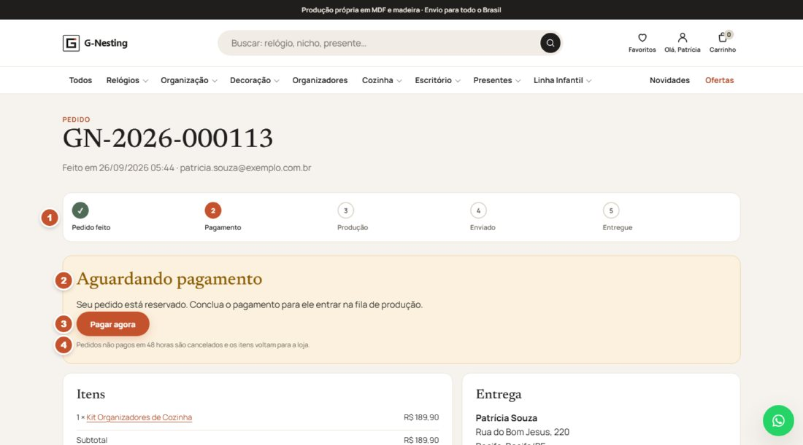

1. **Andamento** em 5 marcos: Pedido feito → Pagamento → Produção → Enviado → Entregue.
2. **Situação atual** e o que ela significa.
3. **Pagar agora**: abre de novo o pagamento no Mercado Pago. Use se o pagamento não foi concluído ou foi recusado.
4. Aviso do prazo: pedidos não pagos em 48 horas são cancelados.

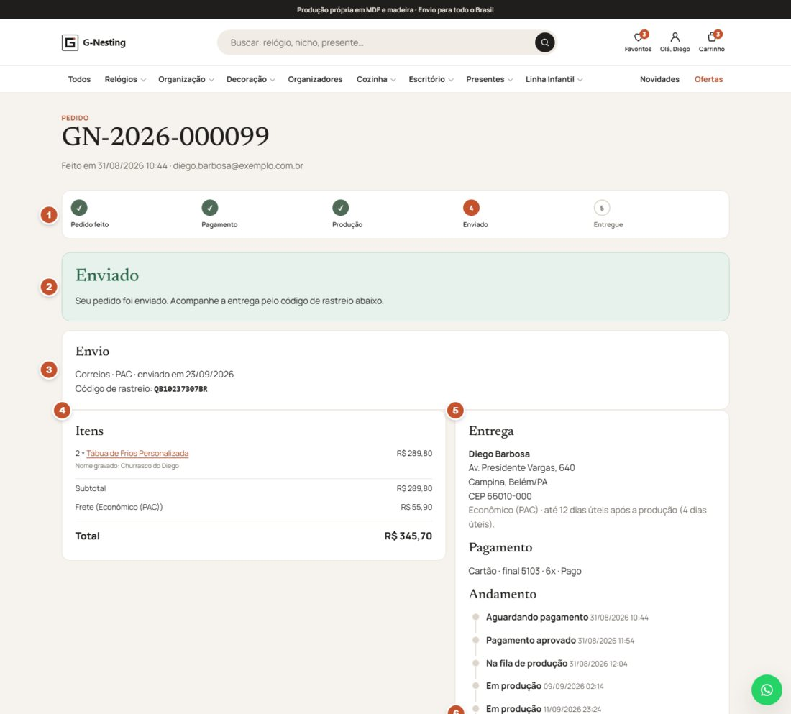

1. **Andamento**: pedido já enviado.
2. **Situação** e a explicação do momento do pedido.
3. **Envio**: transportadora, serviço, data de envio e **Código de rastreio** (com o link **Rastrear**, quando a loja informa).
4. **Itens**, com a personalização de cada um, subtotal, desconto, frete e total.
5. **Entrega**: endereço, opção de frete e prazo. Mais abaixo, **Pagamento** (meio, final do cartão, parcelas, situação).
6. **Andamento**: o histórico com data e hora de cada mudança.

Quando a loja envia uma mensagem pelo painel, ela aparece na página em **Mensagens da G-Nesting** (e chega por e-mail). No fim da página, **Falar sobre este pedido no WhatsApp** abre uma conversa com a loja já com o número do pedido (quando o WhatsApp está configurado).

## 8.3 Situações do pedido

O cliente vê nomes simplificados; a equipe vê o nome completo no painel.

| O cliente vê | Situação no painel | O que significa | Quem muda |
|---|---|---|---|
| Aguardando pagamento | Aguardando pagamento | pedido registrado, pagamento não confirmado | sistema, ao receber o pagamento |
| Pagamento aprovado | Pagamento aprovado | o pagamento foi confirmado | Mercado Pago (automático) |
| Na fila de produção | Produção pendente | pago e aguardando a oficina começar | sistema (logo após o pagamento) |
| Em produção | Em produção | a peça está no CNC, no lixamento ou na montagem | fila de produção |
| Em produção | Acabamento | pintura, verniz ou secagem | fila de produção |
| Em produção | Controle de qualidade | conferência final da peça | fila de produção |
| Preparando o envio | Embalagem | a peça está sendo embalada | fila de produção |
| Preparando o envio | Pronto para envio | embalado, aguardando a transportadora | fila de produção |
| Enviado | Enviado | com a transportadora; tem rastreio | expedição ou gestor |
| Entregue | Entregue | recebido pelo cliente | expedição ou gestor |
| Cancelado | Cancelado | cancelado pela loja ou por falta de pagamento | gestor ou sistema (48 h) |

> **OBSERVAÇÃO:** quando um pedido tem vários itens, ele acompanha o **item mais atrasado**: só passa para "Pronto para envio" quando todas as peças estiverem prontas.

## 8.4 Cancelamento e troca

O cliente **não cancela o pedido pela loja**. Para cancelar, trocar ou devolver, fale com a loja pelo e-mail de contato ou pelo WhatsApp, informando o número do pedido (ex.: GN-2026-000084). As regras estão em **Trocas e devoluções**, no rodapé:

- direito de arrependimento: até **7 dias corridos** após o recebimento, com o produto sem uso e na embalagem original;
- peças personalizadas são feitas exclusivamente para o cliente; em caso de defeito ou erro da loja na personalização, a loja faz uma nova peça ou devolve o valor;
- defeitos ou avarias de transporte: em até **90 dias** após o recebimento, com fotos da peça e da embalagem.

---

# 9. Área do cliente

**Perfil:** CLIENTE

A área do cliente fica em **Minha conta** (clique em **Olá, nome** no topo). Ela tem três páginas: **Resumo**, **Meus pedidos** e **Favoritos**.

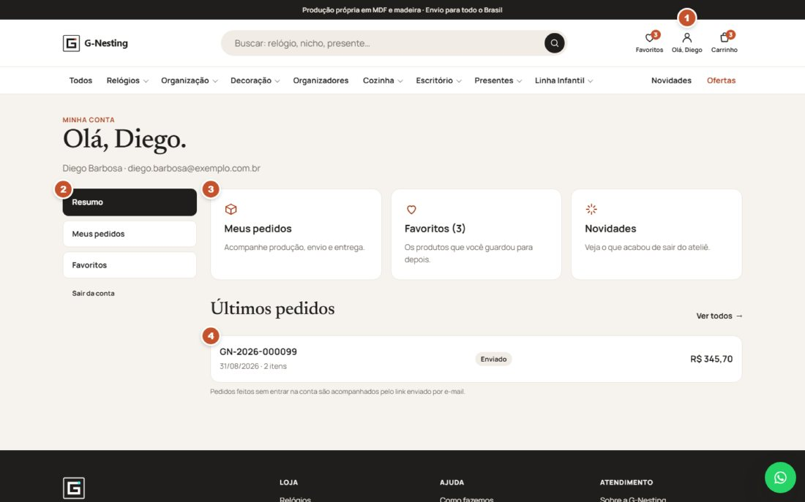

1. **Olá, nome**: no topo de qualquer página, leva à sua conta.
2. **Menu da conta**: **Resumo**, **Meus pedidos**, **Favoritos** e **Sair da conta**.
3. Atalhos para **Meus pedidos**, **Favoritos** (com a quantidade) e **Novidades**.
4. **Últimos pedidos**, com número, data, quantidade de itens, situação e total. Clique para abrir.

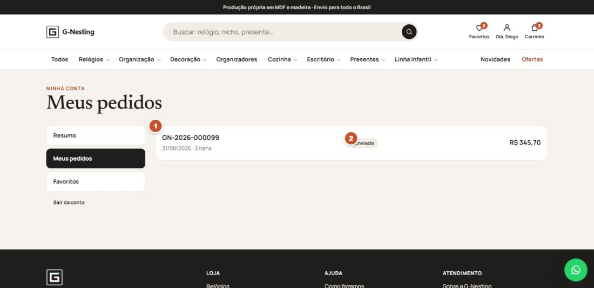

1. Cada pedido feito com a conta. Clique para abrir a página do pedido (seção 8.2).
2. **Situação** atual.

> **OBSERVAÇÃO:** pedidos feitos **sem entrar na conta** não aparecem aqui, mesmo com o mesmo e-mail. Eles são acompanhados pelo link enviado por e-mail.

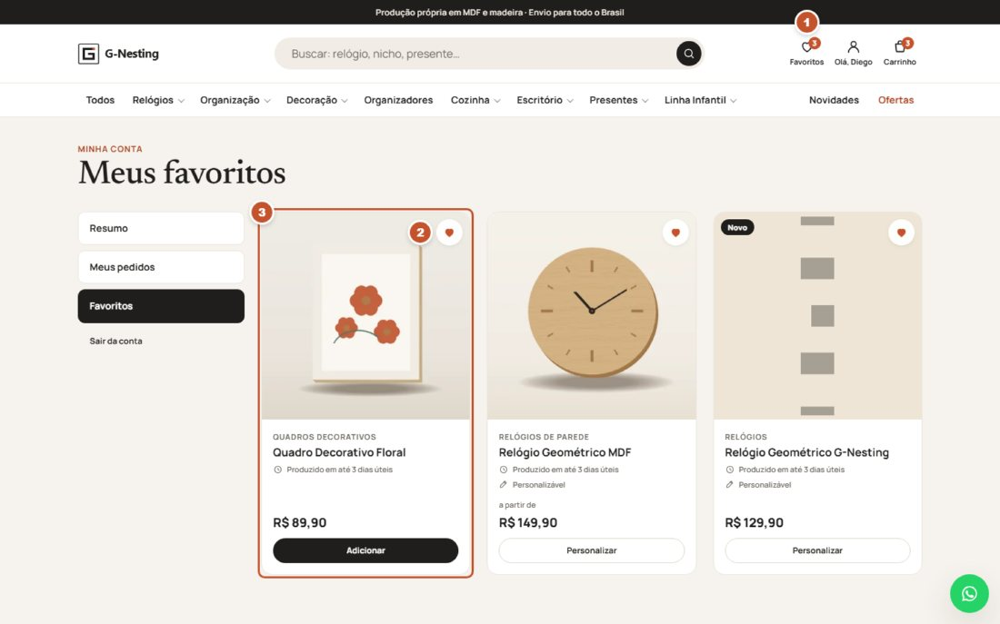

1. **Favoritos** no topo, com a quantidade.
2. **Coração preenchido**: o produto está nos favoritos. Clique para retirar.
3. Cada favorito é um cartão de produto normal: dá para abrir ou adicionar ao carrinho.

## 9.1 O que a área do cliente não tem

- Alterar nome, e-mail ou senha. A senha pode ser trocada por **Esqueci minha senha** (seção 3.3). Para mudar nome ou e-mail, fale com a loja.
- Gerenciar endereços. Eles são salvos na finalização da compra.
- Cancelar pedidos (seção 8.4).
- Pedir a exclusão da conta pela tela: o pedido é feito pelo e-mail de contato, e a loja executa pelo painel (seção 17.3), conforme a **Política de privacidade**.

---

# 10. Painel administrativo

**Perfil:** PROPRIETÁRIO · GESTOR · PRODUÇÃO · ATENDIMENTO

## 10.1 Entrar no painel

O painel fica em `/admin` (ex.: `https://sualoja.com.br/admin`). Cada pessoa da equipe tem o próprio usuário, criado pelo proprietário (capítulo 20).

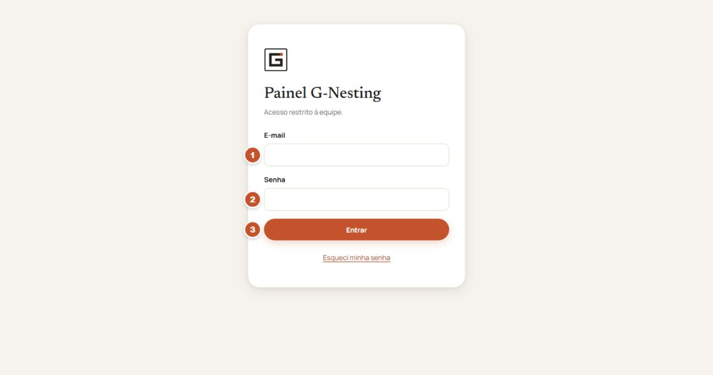

1. **E-mail** do usuário do painel.
2. **Senha**. A senha do painel tem no mínimo 12 caracteres.
3. **Entrar**. Abaixo, **Esqueci minha senha** envia um link de nova senha para o e-mail do usuário (vale por 60 minutos, como na loja).

> **ATENÇÃO:** depois de 5 tentativas erradas em 15 minutos, o login fica bloqueado por alguns minutos. Toda entrada no painel fica registrada na auditoria, com data, hora e IP.

> **OBSERVAÇÃO:** por segurança, a sessão do painel termina depois de um tempo sem uso e, de qualquer forma, **12 horas** depois de entrar. É só entrar de novo.

## 10.2 A tela do painel

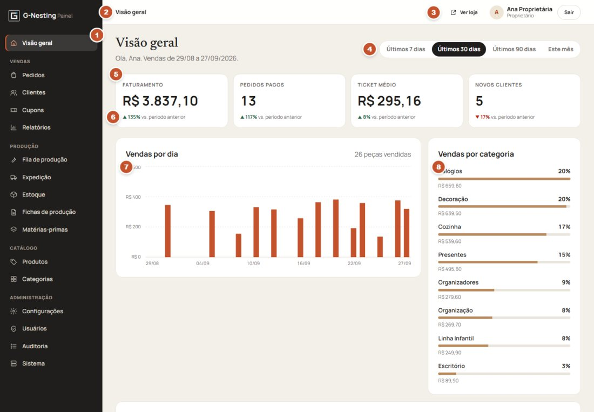

1. **Menu lateral**, em grupos: **Vendas** (Pedidos, Clientes, Cupons, Relatórios), **Produção** (Fila de produção, Expedição, Estoque, Fichas de produção, Matérias-primas), **Catálogo** (Produtos, Categorias) e **Administração** (Configurações, Usuários, Auditoria, Sistema). Cada pessoa vê só os itens do seu perfil.
2. **Trilha**: onde você está (ex.: Painel › Catálogo › Produtos). Clique num nível para voltar.
3. **Ver loja** abre a loja numa nova aba. Ao lado, o nome e o perfil de quem entrou, e **Sair**.

Os itens 4 a 8 da figura são da Visão geral (capítulo 11).

| Perfil | Itens do menu |
|---|---|
| Proprietário | todos |
| Gestor | Visão geral, Vendas, Produção e Catálogo |
| Produção | Visão geral, Pedidos, e o grupo Produção |
| Atendimento | Visão geral, Pedidos e Clientes |

Um endereço fora do perfil (por exemplo, a produção abrindo `/admin/cupons`) mostra "acesso negado".

## 10.3 Painel no celular

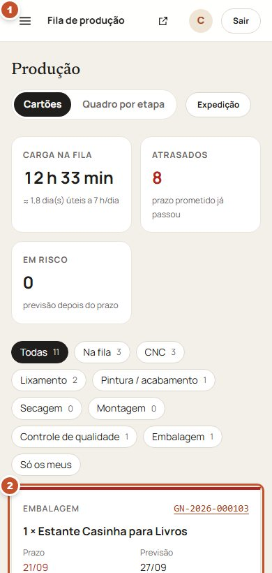

1. **Menu ☰**: abre o menu lateral (figura 10.4). Ao lado, o nome da página, **Ver loja**, a pessoa e **Sair**.
2. O conteúdo se reorganiza em uma coluna. Na fila de produção, cada ordem vira um cartão com o botão de avançar.

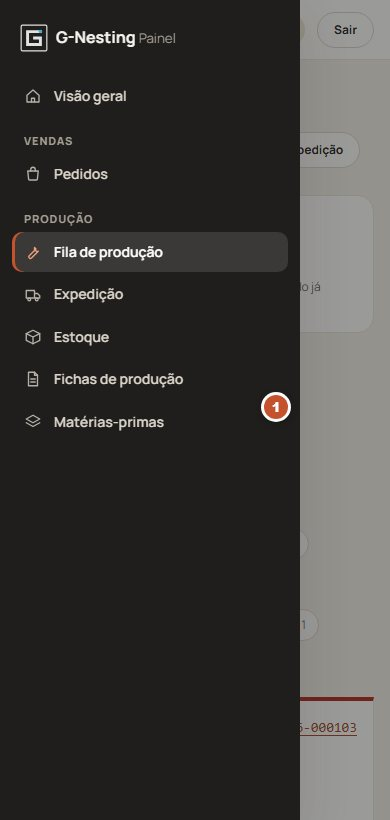

1. O menu mostra só os módulos do perfil. No fim, quando o celular permite, aparece **Instalar o painel no celular**.

> **DICA:** instale o painel no celular da oficina (seção 4.8 explica a instalação; no painel o botão é **Instalar o painel no celular**). O aplicativo do painel tem ícone próprio, escuro, diferente do da loja, e atalhos para **Pedidos**, **Fila de produção** e **Expedição**.

## 10.4 Padrões das telas

- **Mensagens**: depois de salvar, aparece uma faixa verde de confirmação ("Produto salvo.") ou vermelha de erro, com o motivo. Em formulários, o erro aparece embaixo do campo.
- **Campos opcionais** trazem "(opcional)" ao lado do nome. Os demais são obrigatórios.
- **Ações que não se desfazem** (excluir, cancelar, restaurar) pedem confirmação. Algumas exigem digitar uma palavra (ex.: REMOVER, RESTAURAR, ANONIMIZAR).
- **Filtros** ficam no endereço da página: dá para salvar nos favoritos do navegador um filtro que você usa sempre.
- **Registro**: toda alteração importante fica na **Auditoria** (seção 23.2), com quem fez e quando.

---

# 11. Visão geral (dashboard)

**Perfil:** PROPRIETÁRIO · GESTOR · PRODUÇÃO · ATENDIMENTO

É a primeira tela depois do login. Mostra como estão as vendas e o que precisa de atenção.


4. **Período**: **Últimos 7 dias**, **Últimos 30 dias**, **Últimos 90 dias** ou **Este mês**. Todos os números da tela seguem o período.
5. **Indicadores**: **Faturamento** (pedidos pagos), **Pedidos pagos**, **Ticket médio** (faturamento ÷ pedidos) e **Novos clientes**.
6. **Comparação** com o período anterior de mesmo tamanho: seta verde para cima (melhorou) ou vermelha para baixo (piorou).
7. **Vendas por dia**: gráfico de barras do faturamento diário. Acima, o total de peças vendidas.
8. **Vendas por categoria**: participação de cada categoria principal no faturamento.

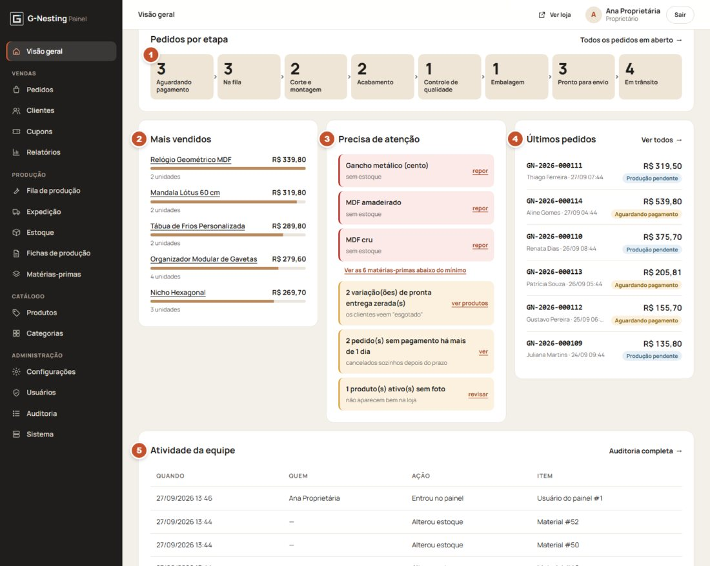

1. **Pedidos por etapa**: quantos pedidos em aberto estão em cada fase, de **Aguardando pagamento** a **Em trânsito**. Clique numa etapa para ver os pedidos dela.
2. **Mais vendidos** do período, com o valor e as unidades.
3. **Precisa de atenção**: alertas que pedem ação:
   - matérias-primas **sem estoque** ou abaixo do mínimo (link **repor**);
   - variações de pronta entrega **zeradas** ("os clientes veem 'esgotado'");
   - pedidos **sem pagamento há mais de 1 dia** ("cancelados sozinhos depois do prazo");
   - produtos **ativos sem foto**.

   Quando não há nada, aparece "Tudo em ordem: estoque acima do mínimo e nenhum pedido parado."
4. **Últimos pedidos**, com cliente, data, valor e situação. **Ver todos** abre a lista de pedidos.
5. **Atividade da equipe** (só para o proprietário): as últimas ações registradas (quem, o quê, quando). **Auditoria completa** abre o registro inteiro.

> **OBSERVAÇÃO:** faturamento conta pela **data do pagamento**; pedidos cancelados não entram.

---

# 12. Categorias

**Perfil:** PROPRIETÁRIO · GESTOR

As categorias organizam o catálogo e formam o menu da loja. Há dois níveis: **categorias principais** (ex.: Relógios) e **subcategorias** (ex.: Relógios de parede).

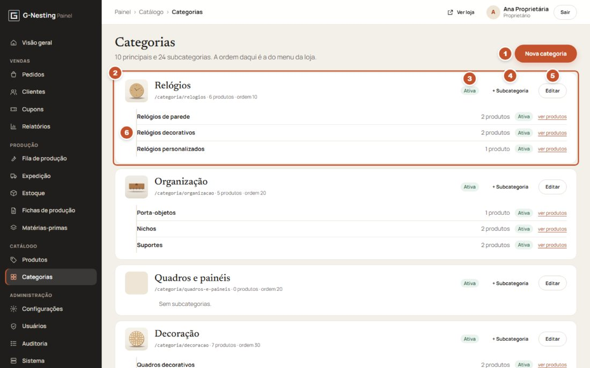

1. **Nova categoria**.
2. **Categoria principal**, com a foto, o endereço na loja, a quantidade de produtos e a ordem.
3. **Situação**: **Ativa** ou **Inativa**.
4. **+ Subcategoria**: cria uma subcategoria já ligada a esta.
5. **Editar**.
6. **Subcategorias**, com a quantidade de produtos, a situação e **ver produtos**.

A ordem desta tela é a ordem do menu da loja.

## 12.1 Criar ou editar uma categoria

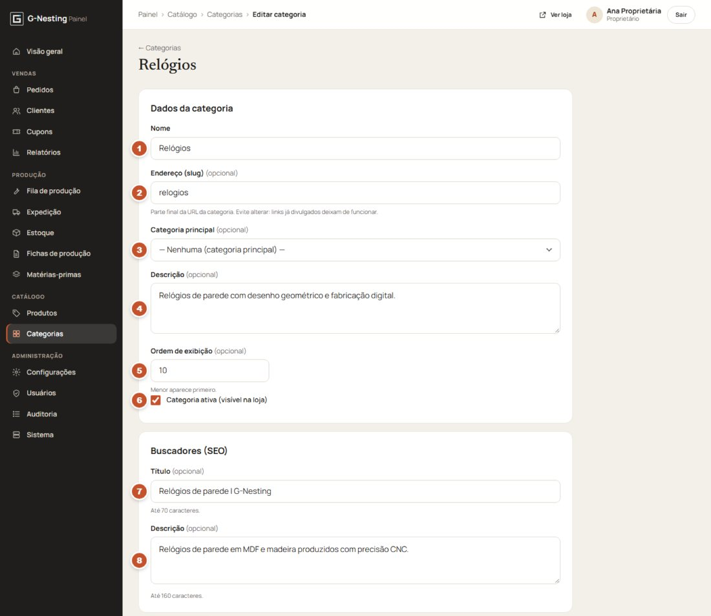

| Nº | Campo | Para que serve e quando usar | Como preencher (exemplo) | Cuidados |
|---|---|---|---|---|
| 1 | **Nome** | nome no menu, na página da categoria e nos filtros | "Relógios" | curto e claro; é o que o cliente lê |
| 2 | **Endereço (slug)** (opcional) | parte final do link da categoria: `/categoria/relogios` | vazio = gerado a partir do nome | evite alterar depois de publicado: links já divulgados deixam de funcionar |
| 3 | **Categoria principal** (opcional) | transforma a categoria em subcategoria | "— Nenhuma (categoria principal) —" ou a principal | só há dois níveis: uma subcategoria não pode ter subcategorias |
| 4 | **Descrição** (opcional) | texto abaixo do título da página da categoria | "Relógios de parede com desenho geométrico…" | uma ou duas frases bastam |
| 5 | **Ordem de exibição** (opcional) | posição no menu e na árvore | 10, 20, 30… (menor aparece primeiro) | use intervalos de 10 para encaixar novas categorias no meio |
| 6 | **Categoria ativa (visível na loja)** | mostra ou esconde a categoria | marcado | desativar esconde da loja também **os produtos dela** (e, numa principal, os das subcategorias) |
| 7 | **Título** (SEO, opcional) | título que aparece no Google e na aba do navegador | "Relógios de parede \| G-Nesting" | até 70 caracteres |
| 8 | **Descrição** (SEO, opcional) | resumo que aparece no Google | "Relógios de parede em MDF…" | até 160 caracteres |

> **OBSERVAÇÃO:** a categoria **não tem campo de foto**. A foto que aparece na loja (cartões de "Explore por categoria") é a capa do produto mais vendido da categoria. Uma categoria sem produtos aparece sem foto.

## 12.2 Excluir uma categoria

No fim do formulário de edição, **Excluir categoria**. Só é possível quando ela **não tem produtos nem subcategorias**:

- "Esta categoria tem subcategorias. Mova ou exclua as subcategorias primeiro."
- "Esta categoria tem N produto(s). Mova os produtos para outra categoria antes de excluir."

> **DICA:** para tirar uma categoria da loja sem perder nada, desmarque **Categoria ativa** em vez de excluir.

---

# 13. Produtos

**Perfil:** PROPRIETÁRIO · GESTOR

## 13.1 Lista de produtos

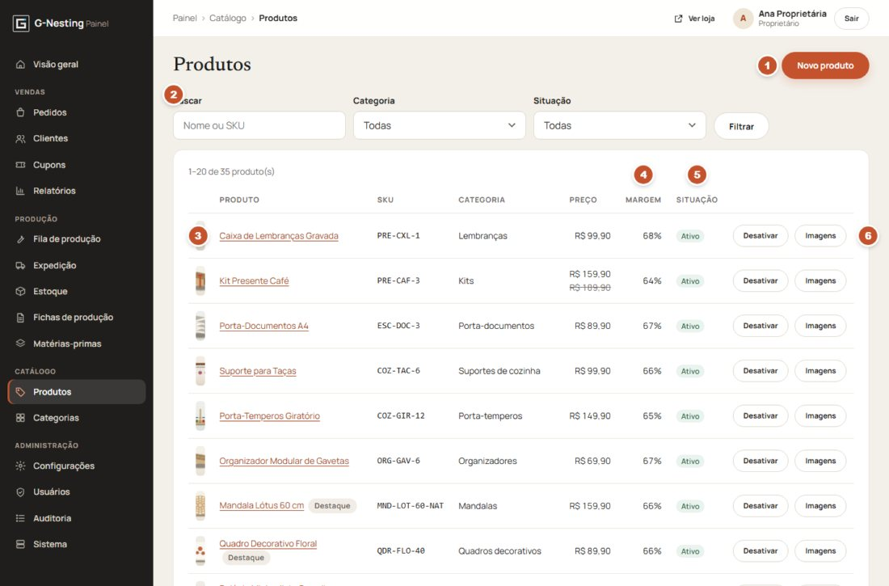

1. **Novo produto**.
2. **Filtros**: **Buscar** (nome ou SKU), **Categoria** e **Situação** (Ativos, Inativos). Clique em **Filtrar**; **Limpar** retira os filtros.
3. **Produto**: foto, nome e selos (**Destaque**, **Lançamento**). Clique no nome para editar.
4. **Margem**: quanto sobra do preço depois do custo, em porcentagem. Aparece "—" quando o custo não foi informado.
5. **Situação**: **Ativo** (à venda) ou **Inativo**.
6. **Ações**: **Ativar** / **Desativar** e **Imagens**.

## 13.2 Como o cadastro está organizado

O cadastro de um produto tem abas:

| Aba | O que tem |
|---|---|
| **Geral** | nome, categoria, textos, selos, material, medidas, montagem e cuidados |
| **Comercial** | preço, preço "de", custo e margem, SKU |
| **Estoque e envio** | modo de estoque, quantidade, prazos, embalagem |
| **Variações** | opções (ex.: tamanho, acabamento) e as versões do produto |
| **Imagens** | fotos |
| **Personalização** | campos que o cliente preenche (nome, inicial, data, opção) |
| **Produção** | ficha de produção de cada variação |
| **SEO** | como o produto aparece no Google |

As abas **Geral**, **Comercial**, **Estoque e envio** e **SEO** são um único formulário: preencha o que precisar em cada uma e clique em **Salvar alterações** uma vez. As outras abas têm telas próprias.

## 13.3 Criar um produto

1. Em **Produtos**, clique em **Novo produto**.
2. Preencha ao menos **Nome do produto**, **Categoria**, **Preço de venda** e **SKU**.
3. Clique em **Criar produto**. "O produto nasce inativo."
4. Na aba **Imagens**, envie as fotos.
5. Clique em **Ativar produto**.

> **IMPORTANTE:** para ativar, o produto precisa de **pelo menos uma imagem**, **preço** e uma **categoria ativa**. Se faltar algo, a mensagem diz o quê: "Para ativar o produto, falta: pelo menos uma imagem."

## 13.4 Aba Geral

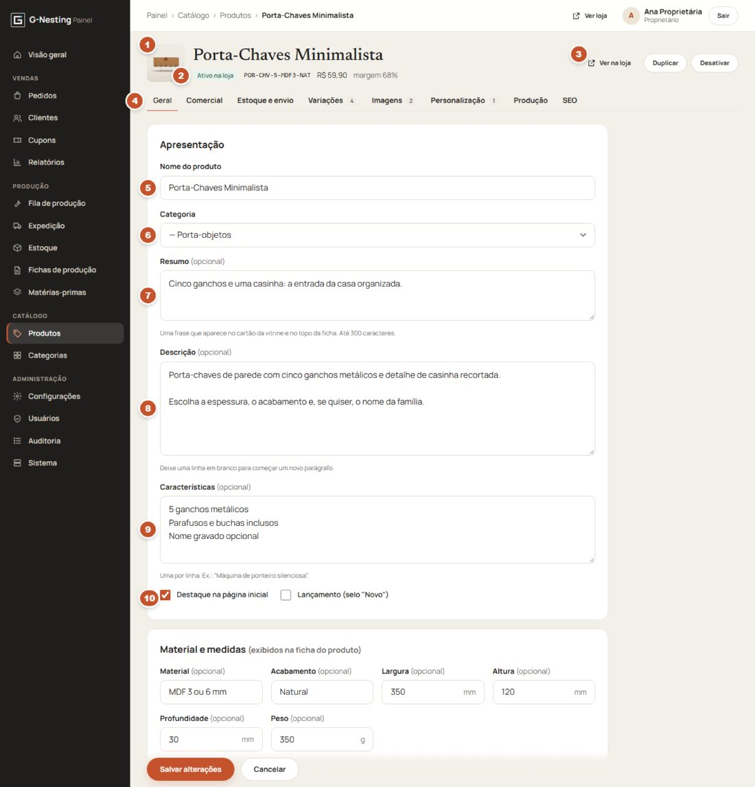

1. **Foto de capa** do produto.
2. **Situação** (**Ativo na loja** ou inativo), SKU, preço e margem.
3. **Ver na loja**, **Duplicar** e **Ativar/Desativar** (seções 13.12 e 13.13).
4. **Abas** do cadastro, com contadores (quantas variações, imagens e campos de personalização).

| Nº | Campo | Para que serve e quando usar | Como preencher (exemplo) | Cuidados |
|---|---|---|---|---|
| 5 | **Nome do produto** | título na loja, no carrinho, nos pedidos e na produção | "Porta-Chaves Minimalista" | sem código e sem preço no nome |
| 6 | **Categoria** | onde o produto aparece no menu e nos filtros | "— Porta-objetos" (subcategorias aparecem com "—") | a categoria precisa estar ativa para o produto aparecer |
| 7 | **Resumo** (opcional) | frase do cartão da vitrine e do topo da página do produto | "Cinco ganchos e uma casinha: a entrada da casa organizada." | até 300 caracteres |
| 8 | **Descrição** (opcional) | texto de **Sobre o produto** | parágrafos separados por uma linha em branco | explique uso, tamanho e diferenciais |
| 9 | **Características** (opcional) | lista com ✓ na página do produto | uma por linha: "5 ganchos metálicos" | frases curtas |
| 10 | **Destaque na página inicial** | inclui em **Destaques da semana** e no filtro **Destaques** | marcar | destaque poucos produtos, para a vitrine não ficar confusa |
| 10 | **Lançamento (selo "Novo")** | mostra o selo **Novo** e inclui o produto na seção **Novidades** da página inicial | marcar enquanto o produto for novidade | desmarque depois de algumas semanas |

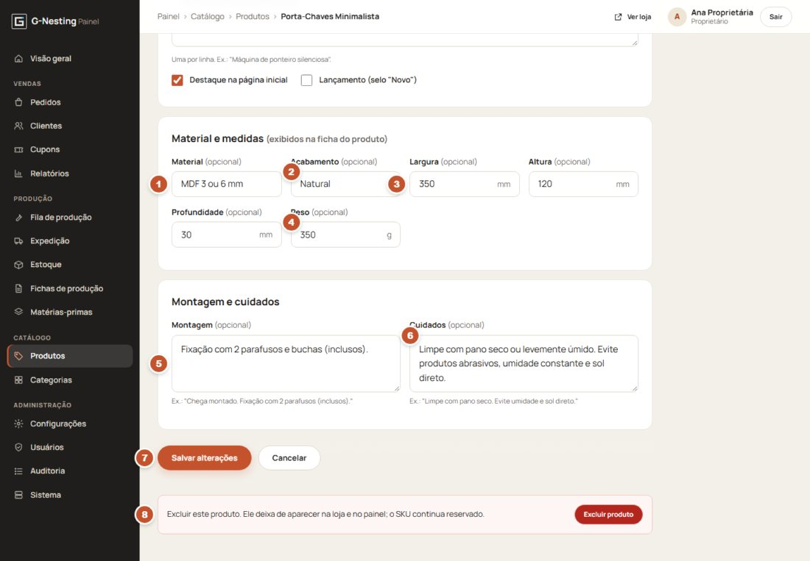

| Nº | Campo | Para que serve e quando usar | Como preencher (exemplo) | Cuidados |
|---|---|---|---|---|
| 1 | **Material** (opcional) | aparece em **Especificações** | "MDF 3 ou 6 mm" | descreva para o cliente; o material da produção fica na ficha de produção |
| 2 | **Acabamento** (opcional) | aparece em **Especificações** | "Natural" | — |
| 3 | **Largura**, **Altura**, **Profundidade** (opcional) | medidas do produto, em mm, mostradas em cm | 350, 120, 30 → "35 × 12 × 3 cm" | medidas da peça, não da caixa (a caixa fica em Estoque e envio) |
| 4 | **Peso** (opcional) | peso do produto, em gramas | 350 | — |
| 5 | **Montagem** (opcional) | texto de montagem na página do produto | "Fixação com 2 parafusos e buchas (inclusos)." | diga o que acompanha |
| 6 | **Cuidados** (opcional) | texto de cuidados | "Limpe com pano seco…" | — |
| 7 | **Salvar alterações** | salva as abas Geral, Comercial, Estoque e envio e SEO | — | — |
| 8 | **Excluir produto** | tira o produto da loja e do painel | — | ver seção 13.14 |

> **OBSERVAÇÃO:** material, acabamento, medidas e peso desta aba são os da **variação padrão**. Cada variação tem os seus (seção 13.8).

## 13.5 Aba Comercial

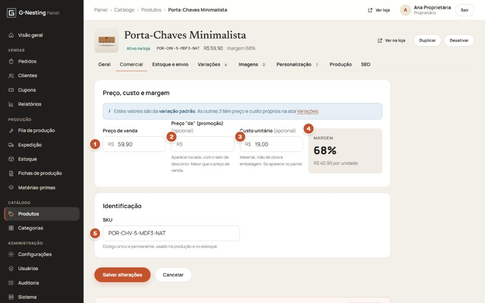

| Nº | Campo | Para que serve e quando usar | Como preencher (exemplo) | Cuidados |
|---|---|---|---|---|
| 1 | **Preço de venda** | preço cobrado do cliente | 59,90 | obrigatório para ativar |
| 2 | **Preço "de" (promoção)** (opcional) | preço antigo, que aparece riscado com o selo de desconto; coloca o produto em **Ofertas** | 79,90 | precisa ser **maior** que o preço de venda. Apague para encerrar a promoção |
| 3 | **Custo unitário** (opcional) | calcula a margem no painel e nos relatórios | 19,00 (material, mão de obra e embalagem) | nunca aparece na loja |
| 4 | **Margem** | calculada sozinha enquanto você digita: porcentagem e valor por unidade | 68% · R$ 40,90 por unidade | sem custo, a margem fica em branco |
| 5 | **SKU** | código único da versão, usado na produção, no estoque e nos pedidos | "POR-CHV-5-MDF3-NAT" | **permanente**: não reutilize SKU de outro produto, nem de produto excluído |

> **OBSERVAÇÃO:** estes valores são da **variação padrão**. Quando o produto tem variações, a faixa azul avisa: "As outras têm preço e custo próprios na aba Variações."

## 13.6 Aba Estoque e envio

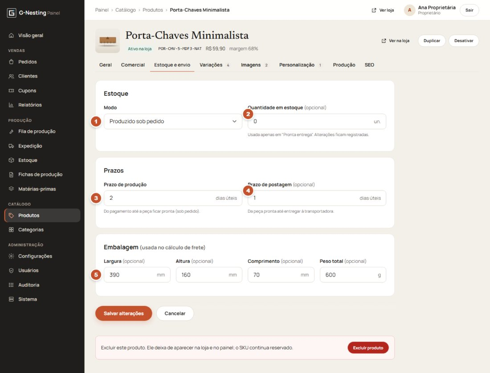

| Nº | Campo | Para que serve e quando usar | Como preencher (exemplo) | Cuidados |
|---|---|---|---|---|
| 1 | **Modo** | **Produzido sob pedido** (feito depois do pagamento) ou **Pronta entrega (controla quantidade)** | sob pedido para peças feitas por encomenda | ao mudar para pronta entrega, informe a quantidade |
| 2 | **Quantidade em estoque** | unidades prontas na prateleira | 12 | só vale em **Pronta entrega**. A alteração fica registrada. Abaixo aparece quanto está **reservado em pedidos** |
| 3 | **Prazo de produção** | dias úteis do pagamento até a peça ficar pronta | 2 | é o prazo prometido ao cliente e usado para "atrasados" na produção |
| 4 | **Prazo de postagem** (opcional) | dias úteis da peça pronta até a transportadora | 1 | aparece na página do produto ("postagem em até 1 dia útil") |
| 5 | **Embalagem**: **Largura**, **Altura**, **Comprimento**, **Peso total** (opcional) | medidas e peso da caixa; o **peso total** é usado no cálculo do frete | 390 × 160 × 70 mm, 600 g | sem peso total, o frete usa o peso do produto + 200 g de embalagem; sem nenhum peso, considera 1 kg. Pese o produto já embalado |

## 13.7 Aba SEO

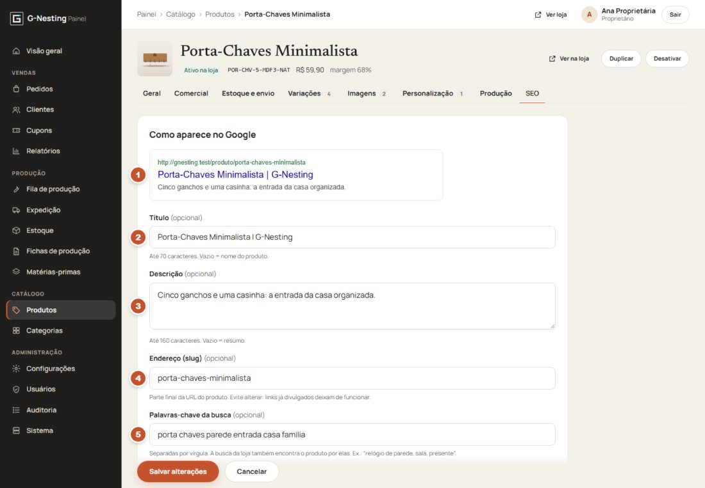

| Nº | Campo | Para que serve e quando usar | Como preencher (exemplo) | Cuidados |
|---|---|---|---|---|
| 1 | **Como aparece no Google** | prévia do resultado de busca, atualizada enquanto você digita | — | só uma prévia; o Google pode mostrar diferente |
| 2 | **Título** (opcional) | título no Google e na aba do navegador | "Porta-Chaves Minimalista \| G-Nesting" | até 70 caracteres. Vazio = nome do produto |
| 3 | **Descrição** (opcional) | texto do resultado no Google | uma frase que convide ao clique | até 160 caracteres. Vazio = resumo |
| 4 | **Endereço (slug)** (opcional) | final do link do produto: `/produto/porta-chaves-minimalista` | vazio = gerado pelo nome | evite mudar depois de divulgado |
| 5 | **Palavras-chave da busca** (opcional) | a busca da loja também encontra o produto por elas | "porta chaves, parede, entrada, casa" | separadas por vírgula; inclua sinônimos que o cliente usa |

## 13.8 Aba Variações

Use variações quando o mesmo produto é vendido em versões diferentes, como tamanho, espessura ou acabamento. Cada versão (variação) tem **SKU, preço, custo, medidas, embalagem e estoque próprios**, e ficha de produção própria.

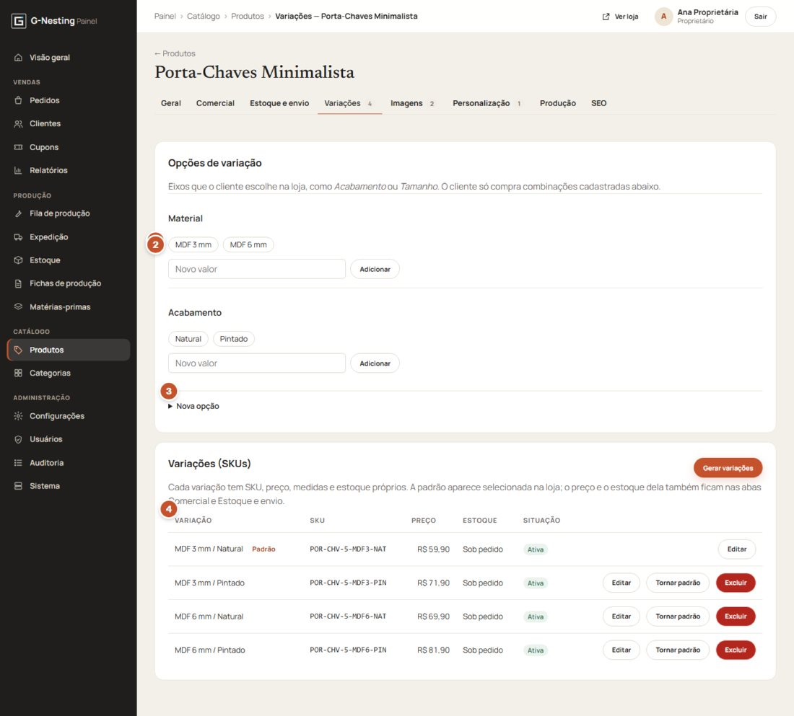

1. **Opção de variação** (ex.: **Material**): um eixo que o cliente escolhe.
2. **Valores** da opção (ex.: MDF 3 mm, MDF 6 mm). Para acrescentar um valor, digite em **Novo valor** e clique em **Adicionar**.
3. **Nova opção**: informe o **Nome** (ex.: Acabamento) e os **Valores** separados por vírgula, e clique em **Criar opção**.
4. **Variações (SKUs)**: cada combinação cadastrada, com SKU, preço, estoque e situação. A **Padrão** é a que aparece selecionada na loja.

**Passo a passo para criar variações:**

1. Crie as opções (ex.: "Material" com "MDF 3 mm, MDF 6 mm"; "Acabamento" com "Natural, Pintado").
2. Clique em **Gerar variações**. O sistema cria todas as combinações que faltam (aqui, 4), copiando os dados da variação padrão, com SKU próprio e estoque zero.
3. Clique em **Editar** em cada variação para ajustar preço, custo, medidas e estoque.
4. Use **Tornar padrão** na versão que deve aparecer selecionada. Use **Excluir** nas combinações que você não vende.

Campos do formulário de uma variação: **SKU**, **Preço de venda**, **Preço "de" (promoção)**, **Custo unitário**, **Ativa (à venda na loja)**, **Material**, **Acabamento**, medidas, **Embalagem**, **Modo** e **Quantidade em estoque**. Funcionam como os campos equivalentes das seções 13.4 a 13.6.

> **IMPORTANTE:** limites: até **3 opções** por produto, **10 valores** por opção e **50 variações** por produto. O cliente só compra as combinações cadastradas na lista.

> **ATENÇÃO:** a variação padrão não pode ser excluída: escolha outra como padrão antes. Um valor usado por variações não pode ser removido enquanto houver variação com ele. Para tornar padrão, a variação precisa estar ativa.

## 13.9 Aba Imagens

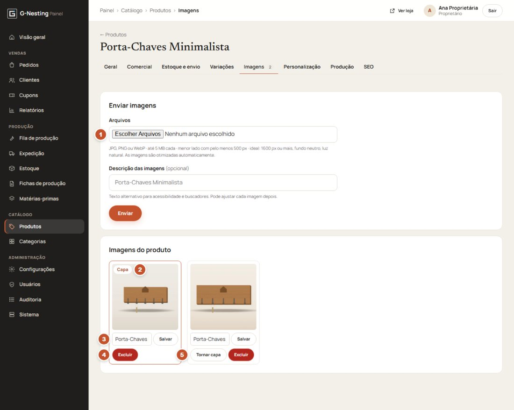

1. **Arquivos**: escolha uma ou várias fotos. Abaixo, **Descrição das imagens** (texto alternativo, opcional) e **Enviar**.
2. **Capa**: a foto que aparece nos cartões e em primeiro lugar na página do produto.
3. **Descrição da imagem** de cada foto, com **Salvar**.
4. **Excluir** a foto.
5. **Tornar capa**: troca a capa. As fotos que não são capa têm também as setas **←** e **→**, que mudam a ordem delas na página do produto.

| Regra | Valor |
|---|---|
| Formatos | JPG, PNG ou WebP |
| Tamanho máximo | 5 MB por foto |
| Tamanho mínimo | menor lado com pelo menos 500 px (ideal: 1600 px ou mais) |
| Quantidade | até 12 fotos por produto |

As fotos são otimizadas sozinhas (tamanhos menores para celular e miniaturas).

> **DICA:** fundo neutro e luz natural. A primeira foto enviada vira a capa; troque com **Tornar capa**. Preencha a **descrição** de cada foto: ajuda pessoas com deficiência visual e o Google.

## 13.10 Aba Personalização

Aqui você define **o que o cliente pode personalizar** e dentro de quais limites. Um produto sem campos não aceita personalização.

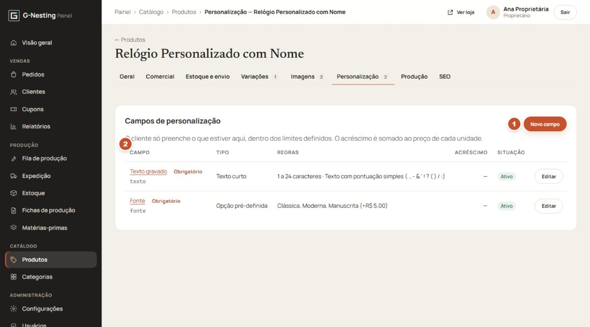

1. **Novo campo**.
2. **Campos cadastrados**: rótulo, tipo, regras, acréscimo, situação e **Editar**.

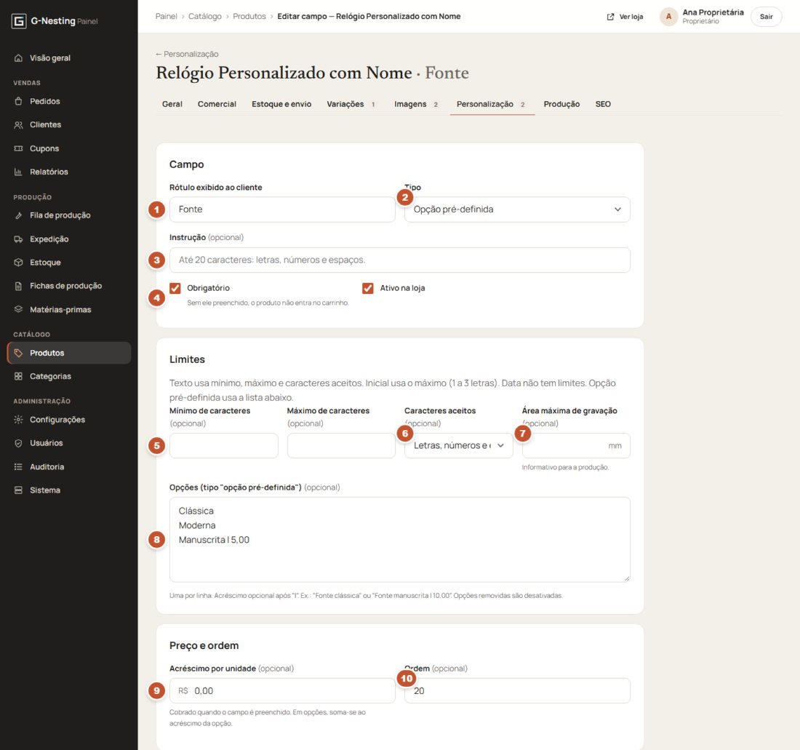

| Nº | Campo | Para que serve e quando usar | Como preencher (exemplo) | Cuidados |
|---|---|---|---|---|
| 1 | **Rótulo exibido ao cliente** | nome do campo na página do produto | "Nome gravado", "Fonte" | claro e curto |
| 2 | **Tipo** | **Texto curto**, **Inicial** (1 a 3 letras), **Data** ou **Opção pré-definida** | Opção pré-definida para escolher a fonte | o tipo define quais limites valem |
| 3 | **Instrução** (opcional) | texto de ajuda embaixo do campo | "Até 20 caracteres: letras, números e espaços." | combine com os limites |
| 4 | **Obrigatório** / **Ativo na loja** | obrigatório: sem ele preenchido, o produto não entra no carrinho. Ativo: o campo aparece na loja | obrigatório para a fonte de um relógio com nome | desmarque **Ativo na loja** para esconder sem excluir |
| 5 | **Mínimo** e **Máximo de caracteres** (opcional) | limite do texto (Inicial usa só o máximo) | 1 e 24 | pense no espaço real de gravação |
| 6 | **Caracteres aceitos** | **Somente letras e espaços**, **Letras, números e espaços** ou **Texto com pontuação simples** | letras e números para nomes | evita símbolos que a máquina não grava bem |
| 7 | **Área máxima de gravação** (opcional) | informação para a produção, em mm | 120 | não é conferida na loja: é só um lembrete para a oficina |
| 8 | **Opções** | lista do tipo **Opção pré-definida**, uma por linha, com acréscimo opcional depois de "\|" | "Clássica", "Moderna", "Manuscrita \| 5,00" | opções apagadas da lista são desativadas, não somem de pedidos antigos |
| 9 | **Acréscimo por unidade** (opcional) | valor cobrado quando o campo é preenchido | 10,00 | em opções, soma-se ao acréscimo da opção |
| 10 | **Ordem** (opcional) | ordem dos campos na página do produto | 10, 20… | — |

> **IMPORTANTE:** o que o cliente digita vai exatamente assim para o pedido, para a fila de produção e para a ordem impressa, com o aviso "conferir letra por letra antes de gravar".

## 13.11 Aba Produção (ficha de produção)

A ficha de produção é o documento técnico de cada variação: **material, corte, programa CNC, etapas com tempos e arquivos**. É interna: nunca aparece na loja. Ela é usada pela fila de produção e pela ordem impressa. O capítulo 15 explica em detalhe (seção 15.1).

## 13.12 Duplicar um produto

**Duplicar** (no topo do produto) cria uma cópia para você cadastrar um produto parecido mais rápido.

| É copiado | Não é copiado |
|---|---|
| dados das abas Geral, Comercial, Estoque e envio e SEO | fotos |
| variações e opções | arquivos de produção (CNC, desenhos) |
| campos de personalização | estoque (a cópia começa com zero) |
| fichas de produção (sem os arquivos) | |

A cópia recebe o nome "… (cópia)", SKUs e endereço novos, e **nasce inativa**. Ajuste nome, SKU e fotos antes de ativar.

## 13.13 Ativar e desativar

- **Desativar**: o produto sai da loja na hora (busca, categorias, página do produto). Pedidos já feitos não mudam.
- **Ativar**: exige imagem, preço e categoria ativa (seção 13.3).

## 13.14 Excluir um produto

No fim da aba Geral, **Excluir produto**: "Ele deixa de aparecer na loja e no painel; o SKU continua reservado."

> **ATENÇÃO:** a exclusão tira o produto do painel. Os pedidos antigos continuam com os dados do produto, mas ele não pode ser reativado pela tela. Na dúvida, **desative** em vez de excluir.

---

# 14. Estoque e matérias-primas

**Perfil:** PROPRIETÁRIO · GESTOR · PRODUÇÃO

O sistema controla dois estoques diferentes:

| Estoque | O que é | Onde fica |
|---|---|---|
| **Produto acabado** | peças prontas de produtos em **Pronta entrega** | **Estoque → Produto acabado** |
| **Matéria-prima** | chapas de MDF, madeira, ferragens, embalagens | **Matérias-primas** e **Estoque → Matéria-prima** |

Produtos **sob pedido** não têm estoque de produto acabado: são feitos depois do pagamento e consomem matéria-prima.

## 14.1 Estoque de produto acabado

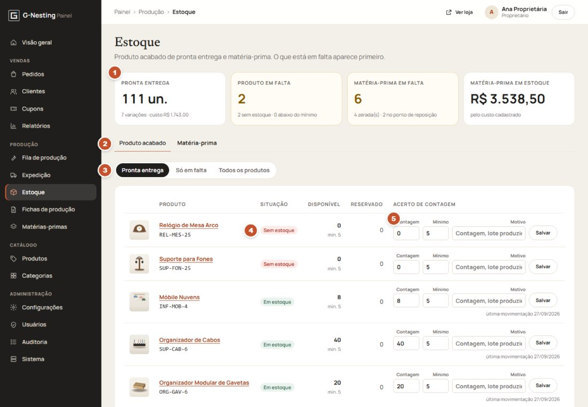

1. **Resumo**: **Pronta entrega** (unidades e custo), **Produto em falta** (sem estoque ou abaixo do mínimo), **Matéria-prima em falta** e **Matéria-prima em estoque** (valor pelo custo cadastrado).
2. **Abas**: **Produto acabado** e **Matéria-prima**.
3. **Filtro**: **Pronta entrega**, **Só em falta** ou **Todos os produtos** (inclui os sob pedido, marcados "Feito após o pedido").
4. **Situação** de cada variação: **Sem estoque**, abaixo do mínimo ou **Em estoque**. O que está em falta aparece primeiro.
5. **Acerto de contagem**: corrija a quantidade física.

Colunas: **Disponível** (o que pode ser vendido, com o mínimo embaixo) e **Reservado** (unidades presas em pedidos ainda não pagos).

**Como fazer um acerto de contagem:**

1. Conte as peças na prateleira.
2. Na linha do produto, digite o total contado em **Contagem**.
3. Se quiser, ajuste o **Mínimo** (abaixo dele, o produto aparece como em falta).
4. Escreva o **Motivo** (ex.: "Contagem de sexta", "Lote produzido").
5. Clique em **Salvar**. Aparece "Estoque atualizado."

> **IMPORTANTE:** o motivo é obrigatório quando a quantidade muda. A **Contagem** é o total físico, incluindo as unidades reservadas: o disponível é a contagem menos o reservado.

> **OBSERVAÇÃO:** o estoque de pronta entrega muda sozinho: é **reservado** quando o pedido é feito, **baixado** quando o pagamento é aprovado e **devolvido** quando um pedido é cancelado. Cada movimento fica registrado.

## 14.2 Matérias-primas

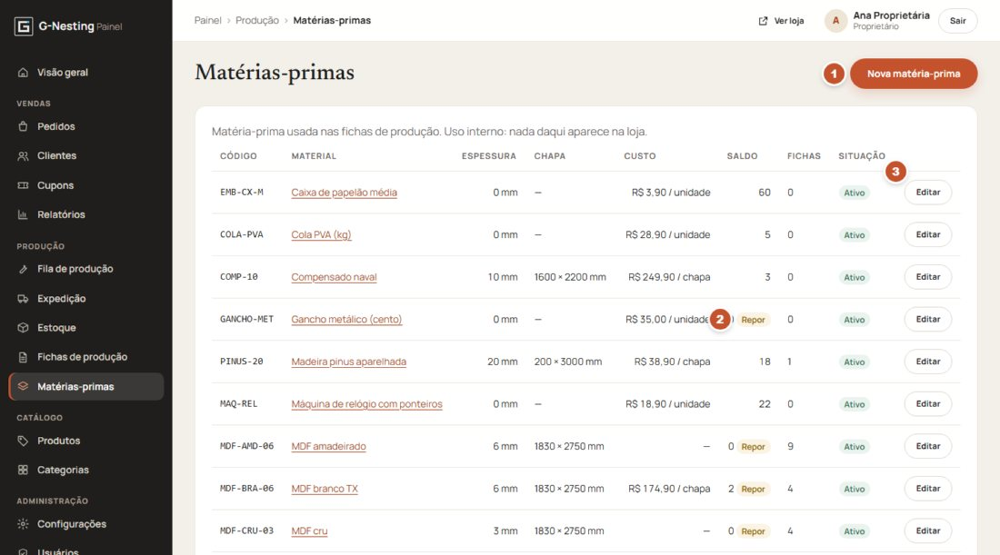

1. **Nova matéria-prima**.
2. **Repor**: aparece quando o saldo está no estoque mínimo ou abaixo.
3. **Editar**.

As colunas mostram **Código**, **Material**, **Espessura**, **Chapa** (medidas), **Custo**, **Saldo**, **Fichas** (quantas fichas de produção usam o material) e **Situação**.

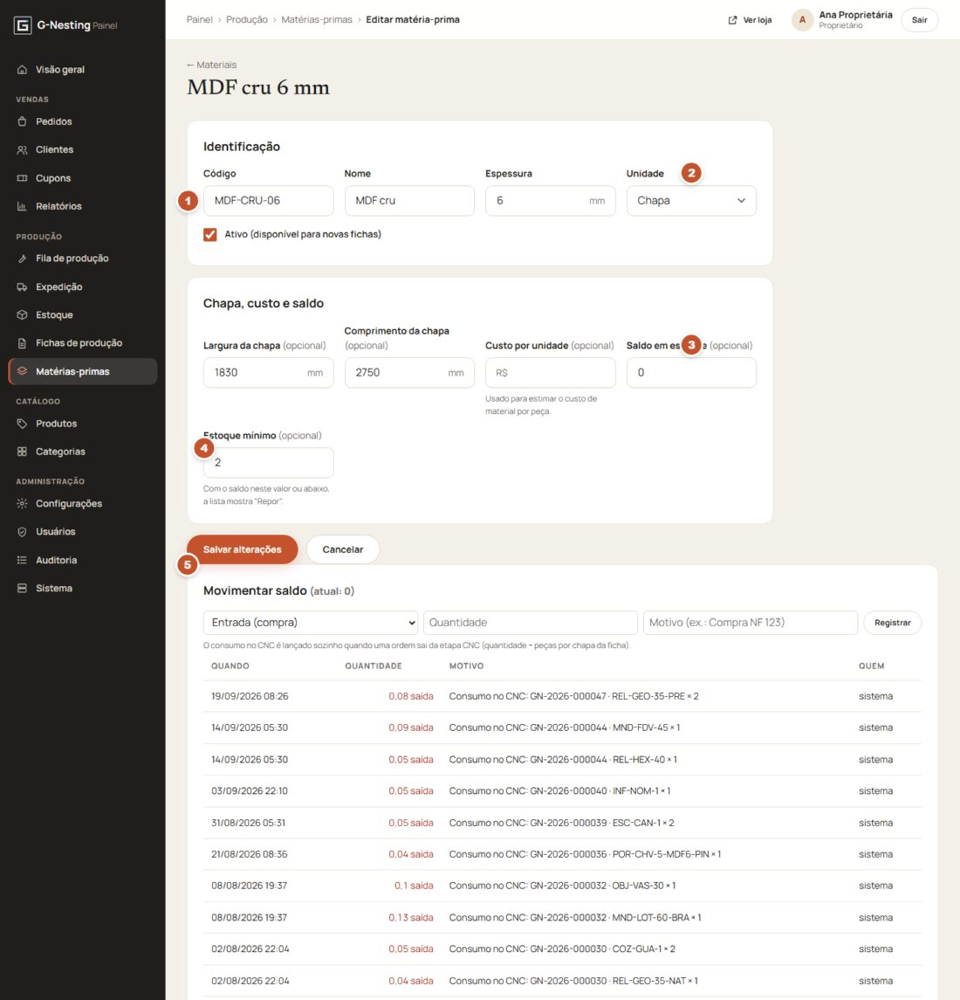

| Nº | Campo | Para que serve e quando usar | Como preencher (exemplo) | Cuidados |
|---|---|---|---|---|
| 1 | **Código** | identifica o material nas fichas e na ordem de produção | "MDF-CRU-06" | único; use um padrão (tipo-cor-espessura) |
| — | **Nome** | nome legível | "MDF cru" | — |
| — | **Espessura** | espessura em mm | 6 | usada como padrão na ficha de produção |
| 2 | **Unidade** | como o material é contado: **Chapa**, **m²** ou **Unidade** | Chapa | o consumo automático do CNC é em chapas |
| — | **Ativo (disponível para novas fichas)** | material inativo não aparece para novas fichas | marcado | — |
| — | **Largura** e **Comprimento da chapa** (opcional) | medidas da chapa, em mm | 1830 × 2750 | — |
| — | **Custo por unidade** (opcional) | estima o custo de material por peça na ficha | 174,90 | atualize quando o preço de compra mudar |
| 3 | **Saldo em estoque** (opcional) | quantidade atual | 12 | para movimentar depois de cadastrado, prefira **Movimentar saldo**: fica registrado |
| 4 | **Estoque mínimo** (opcional) | ponto de reposição: no mínimo ou abaixo, aparece **Repor** | 2 | pense no tempo de entrega do fornecedor |
| 5 | **Movimentar saldo** | registra entradas e saídas | **Entrada (compra)** 10 "Compra NF 123" | ver abaixo |

**Movimentar saldo (entrada de compra ou ajuste):**

1. Abra a matéria-prima (**Editar**) ou use **Entrada ou saída** na aba Matéria-prima do Estoque.
2. Em **Movimentar saldo**, escolha **Entrada (compra)** ou **Saída / ajuste**.
3. Informe a **Quantidade** e o **Motivo** (ex.: "Compra NF 123").
4. Clique em **Registrar**. A tabela embaixo mostra cada movimento, com data, quantidade, motivo e quem fez.

> **OBSERVAÇÃO:** "O consumo no CNC é lançado sozinho quando uma ordem sai da etapa CNC (quantidade ÷ peças por chapa da ficha)." Exemplo: 3 peças de um produto com 5 peças por chapa consomem 0,6 chapa. Esses movimentos aparecem com o motivo "Consumo no CNC: GN-… SKU × quantidade" e quem é "sistema".

> **ATENÇÃO:** uma matéria-prima só pode ser excluída se nenhuma ficha a usar. Caso contrário, desative-a.

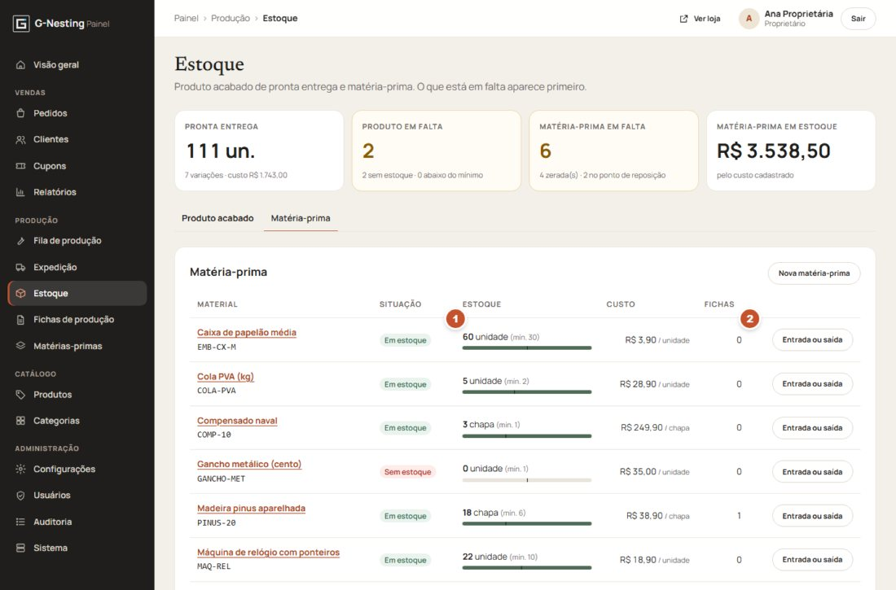

1. **Estoque** de cada material, com o mínimo e uma barra de nível.
2. **Entrada ou saída**: atalho para movimentar o saldo.

---

# 15. Produção

**Perfil:** PROPRIETÁRIO · GESTOR · PRODUÇÃO

## 15.1 Fichas de produção

A ficha de produção diz **como fazer** cada variação. Ela é preenchida uma vez e usada em todas as ordens daquela variação.

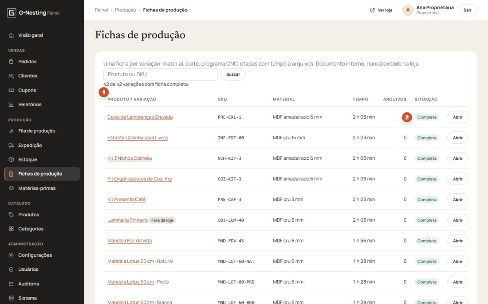

1. **Lista de variações** com material, tempo por peça, quantidade de arquivos e situação. **Buscar** filtra por produto ou SKU; acima, quantas variações têm ficha completa.
2. **Situação**: **Completa**, **Incompleta** (passe o mouse para ver o que falta) ou **Sem ficha**. **Fora da loja** marca produtos ou variações inativos.

Clique em **Abrir** (ou no produto → aba **Produção**) para editar.

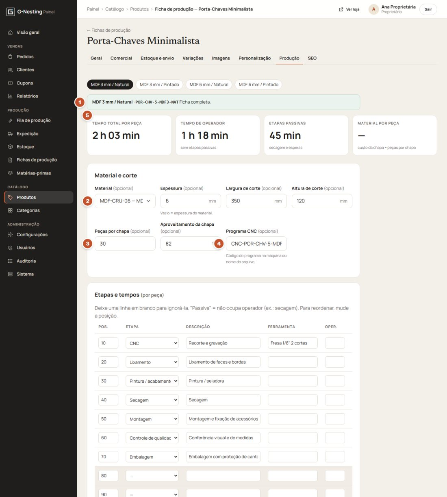

1. **Situação** da ficha ("Ficha completa." ou "Falta: …"), com quem atualizou e quando. Acima, os botões das variações do produto: cada uma tem a sua ficha.
2. **Material**: escolha a matéria-prima cadastrada.
3. **Peças por chapa** e **Aproveitamento da chapa** (%).
4. **Programa CNC**: código do programa na máquina ou nome do arquivo.
5. **Resumo**: **Tempo total por peça**, **Tempo de operador** (sem etapas passivas), **Etapas passivas** (secagem e esperas) e **Material por peça** (custo da chapa ÷ peças por chapa).

| Campo | Para que serve | Exemplo |
|---|---|---|
| **Material** | matéria-prima da peça; alimenta o consumo automático | MDF-CRU-06 — MDF cru 6 mm |
| **Espessura** | vazio = espessura do material | 6 mm |
| **Largura de corte** e **Altura de corte** | tamanho da peça na chapa | 350 × 120 mm |
| **Peças por chapa** | quantas peças saem de uma chapa; define o consumo | 30 |
| **Aproveitamento da chapa** | percentual útil da chapa (informativo) | 82% |
| **Programa CNC** | código do programa ou arquivo | CNC-POR-CHV-5-MDF3 |
| **Etapas e tempos** | as etapas da peça, na ordem: **Etapa**, **Descrição**, **Ferramenta**, **Oper.** (operações), **Minutos** por peça e **Passiva** (não ocupa operador, ex.: secagem) | CNC · Recorte e gravação · Fresa 1/8" · 35 min |
| **Instruções de acabamento** | aparecem na ordem de produção | "Lixar faces e bordas (grão 220)…" |
| **Observações internas** | componentes, montagem, cuidados; só a equipe vê | — |

Etapas disponíveis: **CNC**, **Lixamento**, **Pintura / acabamento**, **Secagem**, **Montagem**, **Controle de qualidade** e **Embalagem**. Linhas em branco são ignoradas. A **Pos.** (posição) organiza as linhas na ficha e na ordem impressa; a sequência de trabalho na fila segue a ordem padrão das etapas (veja o aviso a seguir).

**Copiar de outra variação:** escolha a **Variação de origem** e clique em **Copiar ficha**. "Arquivos não são copiados: cada variação tem os seus."

**Arquivos de produção:** depois de salvar a ficha, envie os arquivos da peça (programas CNC `.nc`, `.tap`, `.gcode`; desenhos `.dxf`, `.svg`, `.pdf`; projetos `.crv`, `.crv3d`; `.zip`), até 20 MB cada. "Mesmo nome = nova versão (as anteriores ficam guardadas)." Cada arquivo tem **Baixar** e **Excluir**.

> **IMPORTANTE:** a rota de cada ordem na fila usa as etapas que estão na ficha, sempre na ordem padrão: CNC → Lixamento → Pintura / acabamento → Secagem → Montagem → Controle de qualidade → Embalagem. **Controle de qualidade** e **Embalagem** entram sempre, mesmo que não estejam na ficha. Uma variação **sem ficha** gera ordens que vão direto da fila para o controle de qualidade e a embalagem: preencha a ficha antes de vender.

## 15.2 Fila de produção

Quando um pedido é pago, cada item vira uma **ordem de produção** na fila, na etapa **Na fila**. A fila é o quadro de trabalho da oficina.

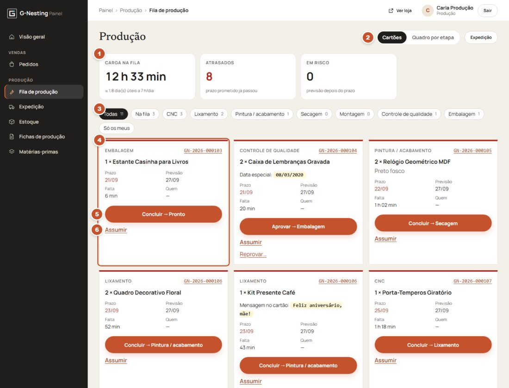

1. **Planejamento**: **Carga na fila** (horas de trabalho somadas e quantos dias úteis isso dá a 7 h/dia), **Atrasados** (o prazo prometido já passou) e **Em risco** (a previsão de término passa do prazo).
2. **Visão**: **Cartões** ou **Quadro por etapa** (figura 15.4). **Expedição** abre a expedição.
3. **Filtro por etapa**, com a quantidade em cada uma, e **Só os meus** (ordens assumidas por você).
4. **Cartão da ordem**: etapa atual, número do pedido, quantidade e produto, variação, personalização (destacada em amarelo), **Prazo** (vermelho quando atrasado), **Previsão**, tempo que **Falta** e **Quem** está com a ordem.
5. **Botão de avançar**: conclui a etapa atual e passa para a próxima. O texto diz o que acontece:
   - **Iniciar CNC** (sai da fila);
   - **Concluir → Lixamento** (etapas comuns);
   - **Aprovar → Embalagem** (no controle de qualidade);
   - **Concluir → Pronto** (última etapa).
6. **Assumir**: coloca a ordem no seu nome. No controle de qualidade aparece também **Reprovar…** (seção 15.4).

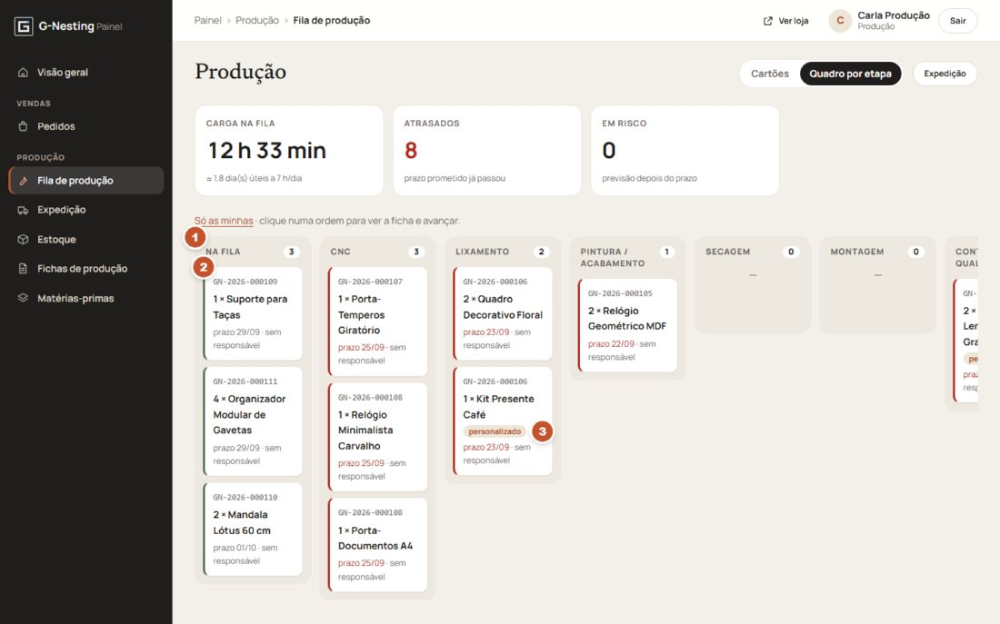

1. **Colunas** por etapa, com a quantidade de ordens.
2. **Ordem**: número do pedido, produto, prazo e responsável. A borda vermelha marca as atrasadas. Clique para abrir a ordem.
3. **personalizado**: a ordem tem personalização para conferir.

Acima do quadro, **Só as minhas** mostra só as suas ordens.

## 15.3 Ordem de produção

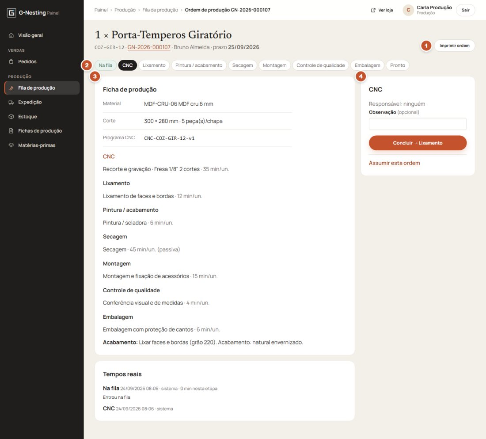

1. **Imprimir ordem** (figura 15.6).
2. **Rota**: as etapas desta ordem. As concluídas ficam verdes; a atual, escura.
3. **Ficha de produção**: material, corte, programa CNC, etapas com tempo por unidade, acabamento e observações. Quando há personalização, ela aparece antes, com o aviso "conferir antes de gravar". Os **Arquivos** da ficha ficam aqui para baixar.
4. **Etapa atual**: **Responsável**, **Observação** (opcional, vai para o histórico), o botão de avançar e **Assumir esta ordem**.

Embaixo, **Tempos reais**: cada etapa com data, hora, quem fez e quanto tempo levou.

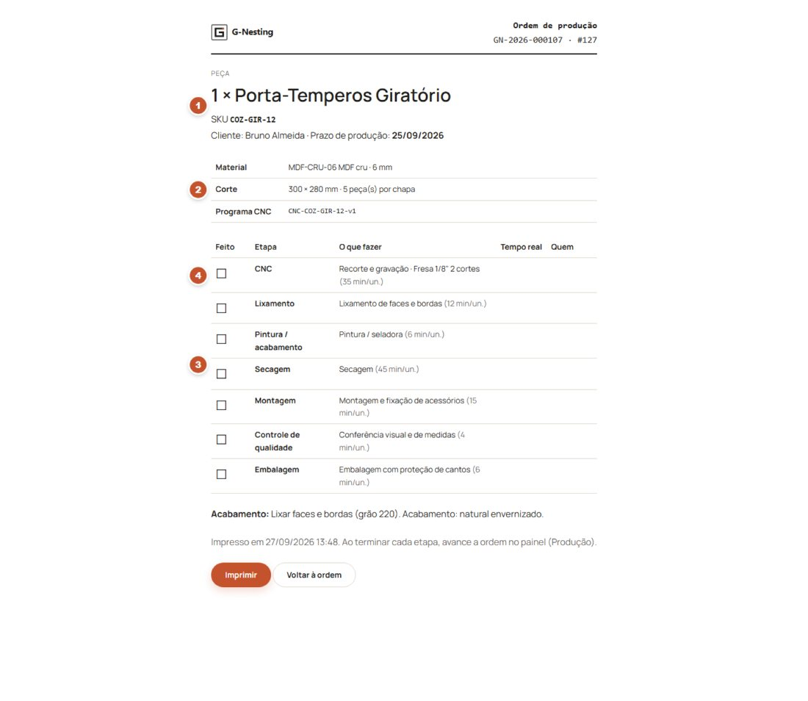

1. **Peça**: quantidade, produto, SKU, cliente e prazo de produção. Quando há personalização, aparece em destaque: "Personalização: conferir letra por letra antes de gravar".
2. **Material**, **Corte** e **Programa CNC**.
3. **Etapas** com o que fazer e o tempo por unidade, e colunas em branco para **Tempo real** e **Quem**.
4. **Feito**: caixas para marcar à mão.

A folha diz, no rodapé: "Ao terminar cada etapa, avance a ordem no painel (Produção)." Use **Imprimir** para mandar à impressora.

## 15.4 Avançar, assumir e retrabalho

**Avançar uma etapa:**

1. Na fila (cartão) ou na ordem, clique no botão de avançar (**Iniciar …**, **Concluir → …**, **Aprovar → …**).
2. Na ordem, você pode escrever uma **Observação** antes.

**Retrabalho (peça reprovada no controle de qualidade):**

1. Na etapa **Controle de qualidade**, clique em **Reprovar…** (na fila) ou em **Reprovar no controle de qualidade** (na ordem).
2. Em **Voltar para**, escolha a etapa em que a peça será refeita (ex.: Lixamento).
3. Escreva o **Motivo** (ex.: "Lasca na borda").
4. Clique em **Enviar para retrabalho**. A ordem volta para aquela etapa e o contador **Retrabalho ×N** aparece no cartão.

> **IMPORTANTE:** o pedido acompanha a fila sozinho. Ninguém precisa mudar a situação do pedido durante a produção:

| Etapa da ordem | Situação do pedido |
|---|---|
| Na fila | Produção pendente |
| CNC, Lixamento, Montagem | Em produção |
| Pintura / acabamento, Secagem | Acabamento |
| Controle de qualidade | Controle de qualidade |
| Embalagem | Embalagem |
| Pronto | Pronto para envio |

Com vários itens, o pedido fica na etapa do **item mais atrasado**. O cliente recebe o e-mail "Seu pedido … está em produção" quando a primeira etapa começa.

> **OBSERVAÇÃO:** ao sair da etapa **CNC**, a matéria-prima da ficha é baixada automaticamente (seção 14.2).

---

# 16. Expedição

**Perfil:** PROPRIETÁRIO · GESTOR · PRODUÇÃO

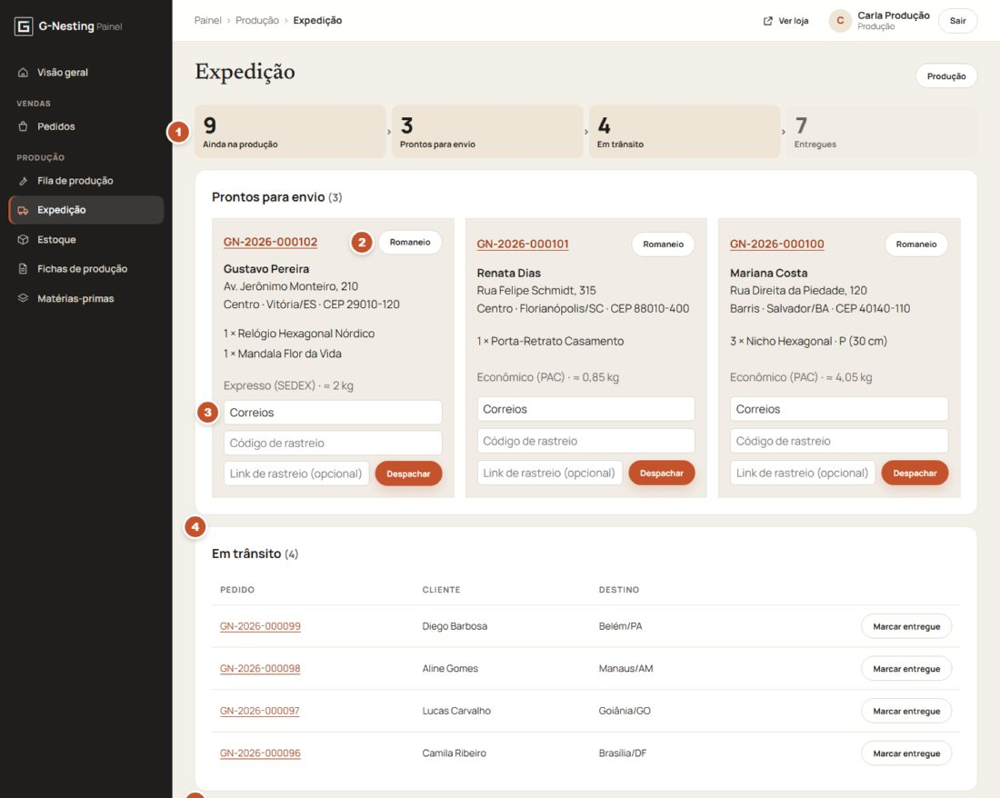

1. **Etapas**: **Ainda na produção**, **Prontos para envio**, **Em trânsito** e **Entregues**, com a quantidade.
2. **Romaneio**: folha de conferência do pacote (figura 16.2).
3. **Dados do envio**: transportadora (vem preenchida com a do frete escolhido), **Código de rastreio** e **Link de rastreio (opcional)**. Clique em **Despachar**.
4. **Em trânsito**: pedidos enviados. **Marcar entregue** quando a entrega for confirmada.
5. **Últimos entregues**. **Todos os entregues** abre a lista de pedidos filtrada.

Cada cartão de **Prontos para envio** mostra o endereço, os itens, o serviço de frete e o peso aproximado.

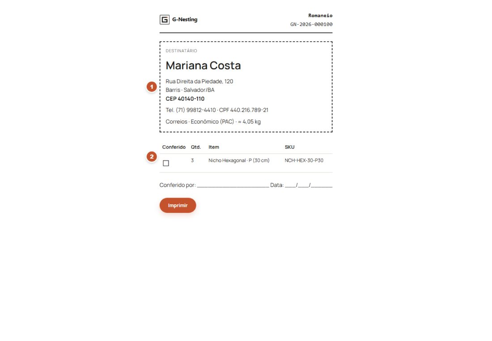

1. **Destinatário**: nome, endereço, CEP, telefone, CPF, transportadora e peso.
2. **Itens** com quantidade e SKU, e a caixa **Conferido**. No fim, "Conferido por" e "Data" para assinar.

**Como despachar um pedido:**

1. Imprima o **Romaneio** e confira as peças na caixa.
2. Gere a etiqueta no site da transportadora (fora do sistema).
3. No cartão do pedido, confira a transportadora e informe o **Código de rastreio** e, se quiser, o **Link de rastreio**.
4. Clique em **Despachar**. O pedido passa para **Enviado** e o cliente recebe o e-mail com o rastreio: "… enviado. O cliente recebeu o rastreio por e-mail."
5. Quando a entrega for confirmada, clique em **Marcar entregue**. O cliente recebe o e-mail de entrega.

> **ATENÇÃO:** o link de rastreio precisa começar com `http://` ou `https://`. O código de rastreio é opcional, mas sem ele o cliente não consegue acompanhar a entrega.

---

# 17. Clientes

**Perfil:** PROPRIETÁRIO · GESTOR · ATENDIMENTO

## 17.1 Lista de clientes

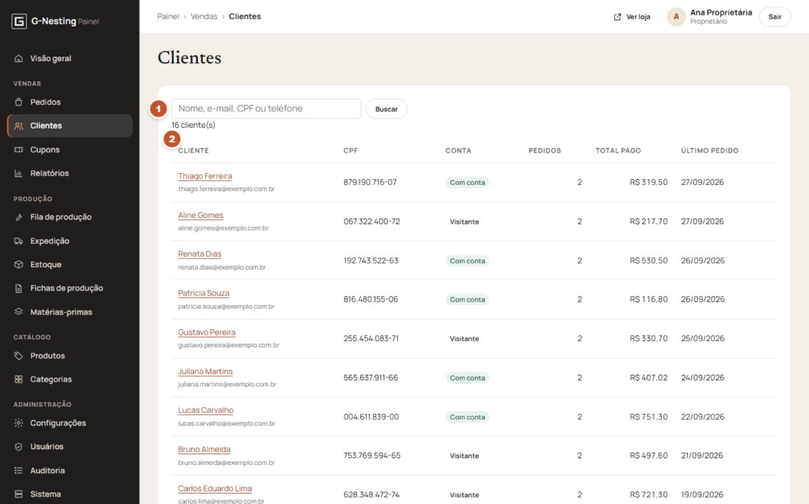

1. **Buscar**: nome, e-mail, CPF ou telefone.
2. **Lista**: nome e e-mail, **CPF**, **Conta** (**Com conta** ou **Visitante**, para quem comprou sem conta), **Pedidos**, **Total pago** e **Último pedido**. Clique no nome para abrir a ficha.

> **OBSERVAÇÃO:** para o perfil **Atendimento**, o CPF aparece parcial (alguns dígitos escondidos). Proprietário e gestor veem o CPF completo.

## 17.2 Ficha do cliente

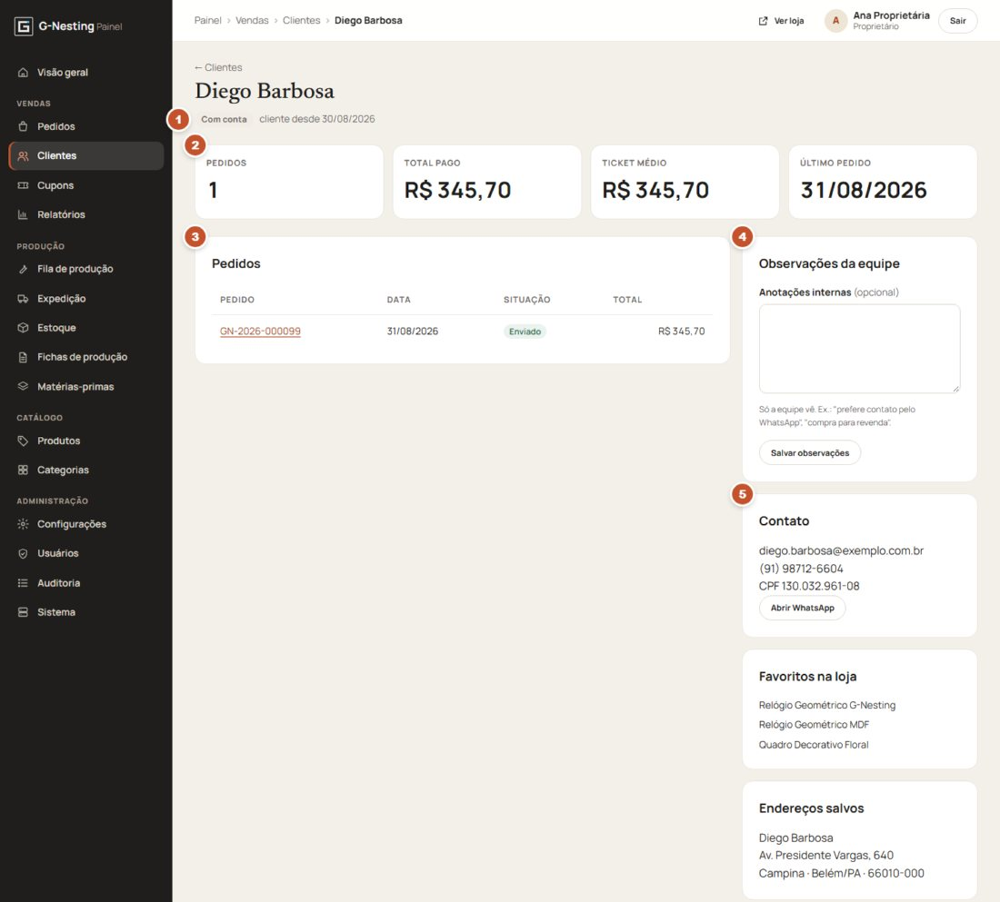

1. **Tipo** (**Com conta** / **Visitante**), data de cadastro e, quando houver, se aceita WhatsApp e novidades por e-mail.
2. **Indicadores**: **Pedidos**, **Total pago**, **Ticket médio** e **Último pedido**.
3. **Pedidos** do cliente, com data, situação e total.
4. **Observações da equipe**: **Anotações internas** (só a equipe vê). Ex.: "prefere contato pelo WhatsApp", "compra para revenda". Clique em **Salvar observações**.
5. **Contato**: e-mail, telefone, CPF e **Abrir WhatsApp**.

Embaixo: **Favoritos na loja** e **Endereços salvos**.

## 17.3 Dados pessoais (LGPD)

**Perfil:** PROPRIETÁRIO

Na ficha do cliente, o proprietário tem o bloco **Dados pessoais (LGPD)**. Use **a pedido do próprio cliente**, depois de confirmar a identidade dele (por exemplo, resposta do e-mail cadastrado). As duas ações ficam registradas na auditoria.

- **Exportar dados (JSON)**: baixa um arquivo com todos os dados do cliente, para entregar a ele.
- **Anonimizar cadastro**: apaga conta, endereços, contato e carrinhos. Os pedidos dos últimos anos ficam guardados sem os dados pessoais (obrigação fiscal). Para confirmar, digite **ANONIMIZAR**.

> **ATENÇÃO:** a anonimização **não pode ser desfeita**. Depois dela, a ficha mostra "Anonimizado em …".

---

# 18. Pedidos no painel

**Perfil:** PROPRIETÁRIO · GESTOR · PRODUÇÃO · ATENDIMENTO

## 18.1 Lista de pedidos

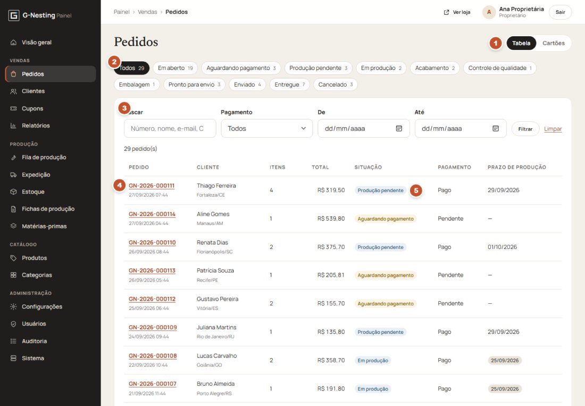

1. **Visão**: **Tabela** ou **Cartões** (figura 18.2).
2. **Abas por situação**, com a quantidade: **Todos**, **Em aberto** (tudo que não foi entregue nem cancelado) e cada situação.
3. **Filtros**: **Buscar** (número, nome, e-mail, CPF ou telefone), **Pagamento** (Pendente, Autorizado, Pago, Estornado, Estornado parcialmente, Recusado, Cancelado) e período (**De**, **Até**). **Filtrar** aplica; **Limpar** retira.
4. **Número do pedido**, com data e hora. Clique para abrir.
5. **Situação** do pedido. As outras colunas: **Cliente** (com cidade), **Itens**, **Total**, **Pagamento** e **Prazo de produção** (destacado quando vencido). **Pers.** indica personalização.

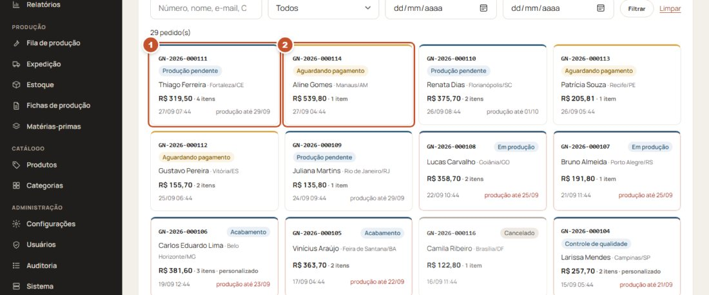

1. **Cartão do pedido**: número, situação, cliente e cidade, valor, itens, data e prazo de produção. Clique no número para abrir.
2. **Cor da borda**: acompanha a situação. O prazo de produção aparece em vermelho quando vencido.

## 18.2 Detalhe do pedido

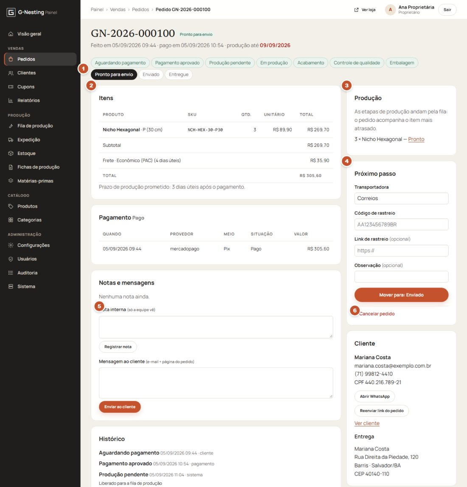

1. **Situação e caminho**: todas as situações do pedido; as já percorridas ficam marcadas e a atual, escura. No topo, datas do pedido, do pagamento e o prazo de produção (em vermelho, quando vencido).
2. **Itens**: produto, variação, SKU, quantidade, preço, personalização, subtotal, frete e total. Embaixo, o prazo de produção prometido.
3. **Produção**: as ordens de cada item e a etapa de cada uma (visível para gestor e produção).
4. **Próximo passo**: as mudanças de situação que o seu perfil pode fazer (seção 18.3).
5. **Notas e mensagens**: **Nota interna** (só a equipe vê) e **Mensagem ao cliente** (vai por e-mail e aparece na página do pedido).
6. **Cancelar pedido** (seção 18.4).

Mais abaixo: **Pagamento** (tentativas, provedor, meio e situação), **Histórico** (cada mudança com data, hora e origem), **Cliente** (contato, CPF, **Abrir WhatsApp**, **Reenviar link do pedido**, **Ver cliente**) e **Entrega** (endereço).

## 18.3 Mudar a situação

| Situação atual | Quem muda e como |
|---|---|
| Aguardando pagamento → Pagamento aprovado | **automático**, quando o Mercado Pago confirma. Não existe botão para marcar como pago |
| Pagamento aprovado → Produção pendente | automático, logo depois do pagamento ("Liberado para a fila de produção") |
| Produção pendente até Pronto para envio | **fila de produção** (capítulo 15). O pedido não é mudado à mão nessas etapas |
| Pronto para envio → Enviado | **Próximo passo** no pedido (gestor ou produção), com **Transportadora**, **Código de rastreio**, **Link de rastreio** e **Observação**, e o botão **Mover para: Enviado**; ou **Despachar** na Expedição |
| Enviado → Entregue | **Próximo passo** no pedido (gestor ou produção) ou **Marcar entregue** na Expedição |
| Qualquer uma até Pronto para envio → Cancelado | **Cancelar pedido** (gestor) |

> **IMPORTANTE:** se um cliente diz que pagou mas o pedido continua em **Aguardando pagamento**, confira o pagamento no painel do Mercado Pago. O sistema só libera o pedido quando o Mercado Pago confirma (seção 26).

## 18.4 Cancelar um pedido

**Perfil:** PROPRIETÁRIO · GESTOR

1. No pedido, abra **Cancelar pedido**.
2. Escreva o **Motivo** (até 200 caracteres). Ele vai para o cliente, no e-mail de cancelamento.
3. Se o pedido já foi pago, escolha a **Devolução do valor**:
   - **Estornar agora pelo provedor de pagamento**: o sistema pede o estorno ao Mercado Pago;
   - **Já estornei por fora (registrar)**: você devolveu o valor de outra forma e só registra.
4. Confirme.

O que acontece: itens de pronta entrega voltam ao estoque; num pedido não pago, a reserva é liberada; as ordens de produção são canceladas; o cliente recebe o e-mail "Pedido … cancelado" com o motivo.

> **ATENÇÃO:** se o Mercado Pago não confirmar o estorno, **nada é cancelado**: "O provedor de pagamento não confirmou o estorno. Nada foi cancelado." Tente de novo ou estorne pelo painel do Mercado Pago e use **Já estornei por fora**. Um pedido **Enviado** ou **Entregue** não pode ser cancelado.

## 18.5 Notas, mensagens e link do pedido

| Ação | Quem pode | Para quem vai |
|---|---|---|
| **Registrar nota** (nota interna) | gestor, produção, atendimento | só a equipe; aparece em **Notas e mensagens** |
| **Enviar ao cliente** (mensagem) | gestor, atendimento | e-mail ao cliente + seção **Mensagens da G-Nesting** na página do pedido |
| **Reenviar link do pedido** | gestor, atendimento | e-mail ao cliente com o link de acompanhamento |
| **Abrir WhatsApp** | quem vê o pedido | abre conversa com o celular do cliente |

> **DICA:** use **Reenviar link do pedido** quando o cliente comprou sem conta e perdeu o e-mail de confirmação.

---

# 19. Cupons de desconto

**Perfil:** PROPRIETÁRIO · GESTOR

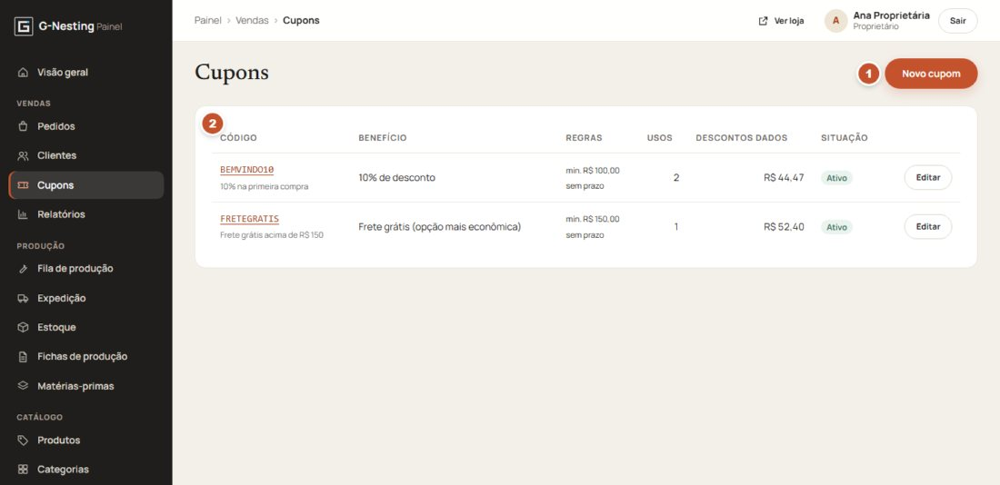

1. **Novo cupom**.
2. **Lista**: **Código** e descrição interna, **Benefício**, **Regras** (compra mínima, prazo), **Usos**, **Descontos dados** (total em reais) e **Situação**: **Ativo**, **Inativo**, **Agendado** (ainda não começou), **Vencido** ou **Esgotado** (atingiu o limite).

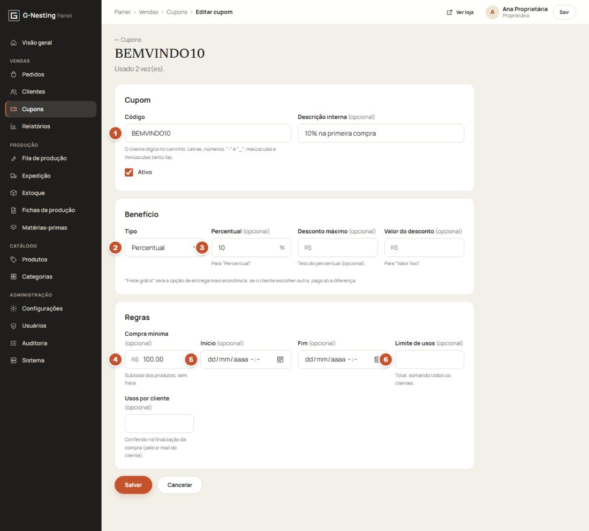

| Nº | Campo | Para que serve e quando usar | Como preencher (exemplo) | Cuidados |
|---|---|---|---|---|
| 1 | **Código** | o que o cliente digita no carrinho | "BEMVINDO10" | letras, números, "-" e "_"; maiúsculas e minúsculas tanto faz |
| — | **Descrição interna** (opcional) | lembrete para a equipe | "10% na primeira compra" | o cliente não vê |
| — | **Ativo** | liga ou desliga o cupom | marcado | desmarque para pausar sem excluir |
| 2 | **Tipo** | **Percentual**, **Valor fixo** ou **Frete grátis** | Percentual | cada tipo usa os campos ao lado |
| 3 | **Percentual** | desconto em % (tipo Percentual) | 10 | — |
| — | **Desconto máximo** (opcional) | teto do desconto percentual | 50,00 | protege a margem em compras grandes |
| — | **Valor do desconto** | desconto em reais (tipo Valor fixo) | 20,00 | — |
| 4 | **Compra mínima** (opcional) | subtotal mínimo dos produtos, sem frete | 100,00 | — |
| 5 | **Início** e **Fim** (opcional) | período de validade | 01/10 00:00 a 31/10 23:59 | fora do período o cupom não vale |
| 6 | **Limite de usos** (opcional) | total de usos, somando todos os clientes | 100 | — |
| — | **Usos por cliente** (opcional) | usos por e-mail | 1 | conferido na finalização da compra |

**Frete grátis** "zera a opção de entrega mais econômica; se o cliente escolher outra, paga só a diferença."

> **ATENÇÃO:** um cupom só pode ser excluído enquanto não foi usado: "já foi usado em pedidos. Desative-o em vez de excluir."

> **DICA:** divulgue o código em maiúsculas e curto. Para uma campanha, crie o cupom com **Início** e **Fim**: ele aparece como **Agendado** antes e **Vencido** depois, sem precisar lembrar de desligar.

---

# 20. Usuários e permissões

**Perfil:** PROPRIETÁRIO

## 20.1 Usuários do painel

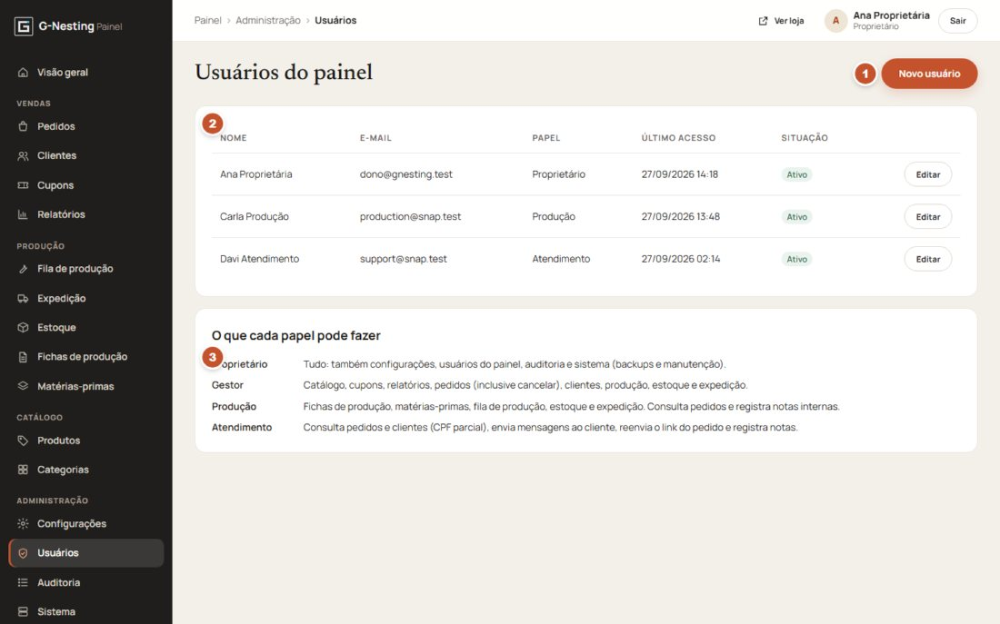

1. **Novo usuário**.
2. **Lista**: nome, e-mail, **Papel**, **Último acesso**, **Situação** e **Editar**.
3. **O que cada papel pode fazer**: resumo dos perfis, na própria tela.

**Criar um usuário:**

1. Clique em **Novo usuário**.
2. Preencha **Nome**, **E-mail** e **Papel** (**Proprietário**, **Gestor**, **Produção** ou **Atendimento**).
3. Defina a **Senha inicial** (mínimo de 12 caracteres) e repita em **Confirme a senha**.
4. Salve e combine com a pessoa um canal seguro para enviar a senha (pessoalmente ou por telefone, nunca junto com o e-mail de acesso).

**Editar:** altere nome, e-mail, papel ou **Acesso ativo**. Desmarcar **Acesso ativo** "bloqueia o acesso sem apagar o histórico": é assim que se tira alguém da equipe.

**Redefinir a senha de outra pessoa:** no formulário do usuário, preencha **Nova senha** e **Confirme a nova senha** e clique em **Redefinir senha**.

> **IMPORTANTE:** usuários do painel **não são excluídos**, apenas desativados, para que o histórico (auditoria, notas, ordens de produção) continue mostrando quem fez cada coisa.

> **ATENÇÃO:** "Você não pode alterar o próprio papel nem desativar a própria conta." e "É preciso manter pelo menos um proprietário ativo." Crie um segundo proprietário antes de rebaixar o primeiro.

## 20.2 Matriz de permissões

| Módulo / ação | Proprietário | Gestor | Produção | Atendimento |
|---|---|---|---|---|
| Visão geral | sim | sim | sim | sim |
| Atividade da equipe (na Visão geral) | sim | — | — | — |
| Pedidos: consultar e registrar nota interna | sim | sim | sim | sim |
| Pedidos: mensagem ao cliente, reenviar link | sim | sim | — | sim |
| Pedidos: marcar enviado e entregue | sim | sim | sim | — |
| Pedidos: cancelar (com estorno) | sim | sim | — | — |
| Pedidos: ver as ordens de produção | sim | sim | sim | — |
| Clientes: consultar, observações | sim | sim | — | sim |
| Clientes: CPF completo | sim | sim | — | parcial |
| Clientes: exportar dados e anonimizar (LGPD) | sim | — | — | — |
| Cupons | sim | sim | — | — |
| Relatórios e CSV | sim | sim | — | — |
| Produtos, variações, imagens, personalização | sim | sim | — | — |
| Categorias | sim | sim | — | — |
| Fichas de produção e matérias-primas | sim | sim | sim | — |
| Fila de produção | sim | sim | sim | — |
| Estoque | sim | sim | sim | — |
| Expedição | sim | sim | sim | — |
| Configurações | sim | — | — | — |
| Usuários | sim | — | — | — |
| Auditoria | sim | — | — | — |
| Sistema (backups, manutenção, demonstração) | sim | — | — | — |

> **DICA:** dê a cada pessoa o menor perfil que atende ao trabalho dela. Quem só atende clientes fica em **Atendimento**; a oficina, em **Produção**.

---

# 21. Relatórios

**Perfil:** PROPRIETÁRIO · GESTOR

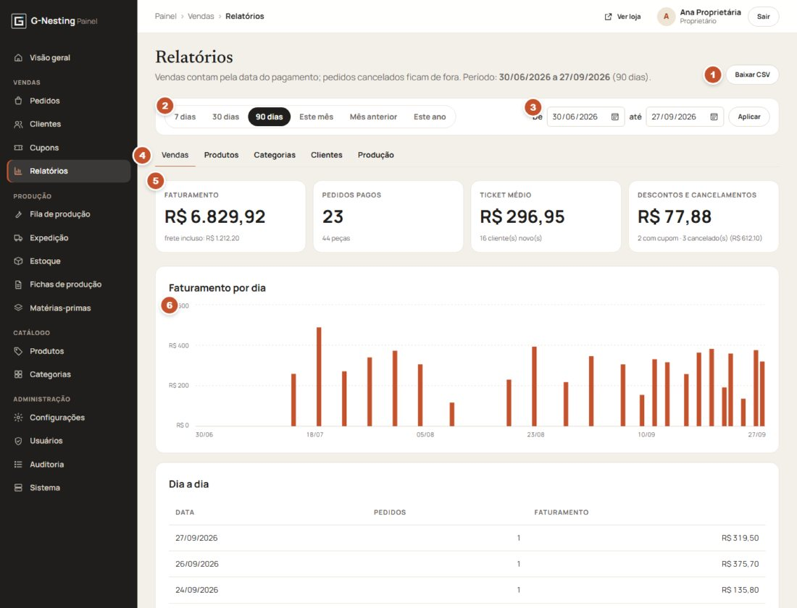

1. **Baixar CSV**: baixa a tabela da aba atual, no período escolhido, para abrir numa planilha.
2. **Período rápido**: **7 dias**, **30 dias**, **90 dias**, **Este mês**, **Mês anterior** e **Este ano**.
3. **Período personalizado**: **De** e **até**, e **Aplicar**.
4. **Abas**: **Vendas**, **Produtos**, **Categorias**, **Clientes** e **Produção**.
5. **Indicadores** da aba Vendas: **Faturamento** (com o frete incluído embaixo), **Pedidos pagos** (e peças), **Ticket médio** (e clientes novos) e **Descontos e cancelamentos**.
6. **Faturamento por dia** (em períodos longos, o gráfico agrupa **por mês**; a tabela e o CSV continuam por dia). Embaixo, a tabela **Dia a dia**.

"Vendas contam pela data do pagamento; pedidos cancelados ficam de fora."

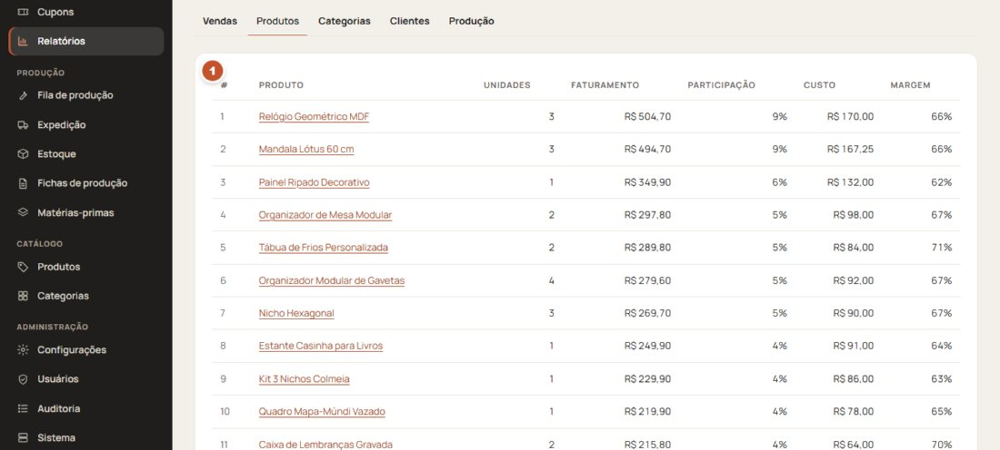

1. **Ranking de produtos**: **Unidades**, **Faturamento**, **Participação**, **Custo** e **Margem**. "Custo e margem usam o custo cadastrado hoje em cada variação."

| Aba | O que mostra |
|---|---|
| **Vendas** | faturamento, pedidos, ticket médio, descontos, cancelamentos, gráfico e dia a dia |
| **Produtos** | ranking com unidades, faturamento, participação, custo e margem |
| **Categorias** | faturamento e participação por categoria |
| **Clientes** | quem mais comprou: cliente, cidade, pedidos, total pago e último pagamento |
| **Produção** | desempenho da oficina (figura 21.3) |

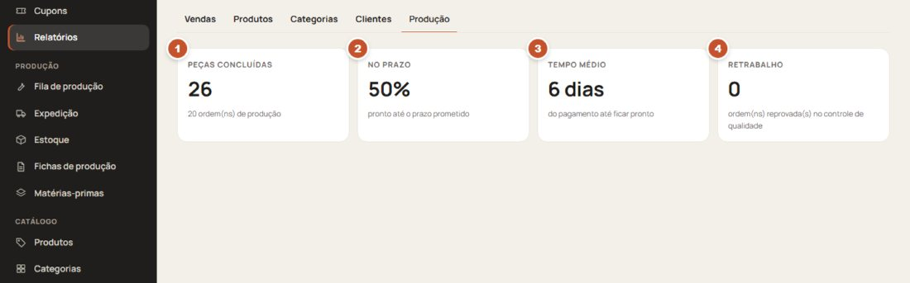

1. **Peças concluídas** e quantas ordens de produção.
2. **No prazo**: percentual de ordens prontas até o prazo prometido.
3. **Tempo médio** do pagamento até a peça ficar pronta.
4. **Retrabalho**: ordens reprovadas no controle de qualidade.

> **OBSERVAÇÃO:** o CSV usa ponto e vírgula e acentos em UTF-8, próprio para o Excel em português. Cada download fica registrado na auditoria.

> **DICA:** a margem do relatório só é confiável se o **Custo unitário** estiver preenchido em todas as variações (seção 13.5).

---

# 22. Configurações

**Perfil:** PROPRIETÁRIO

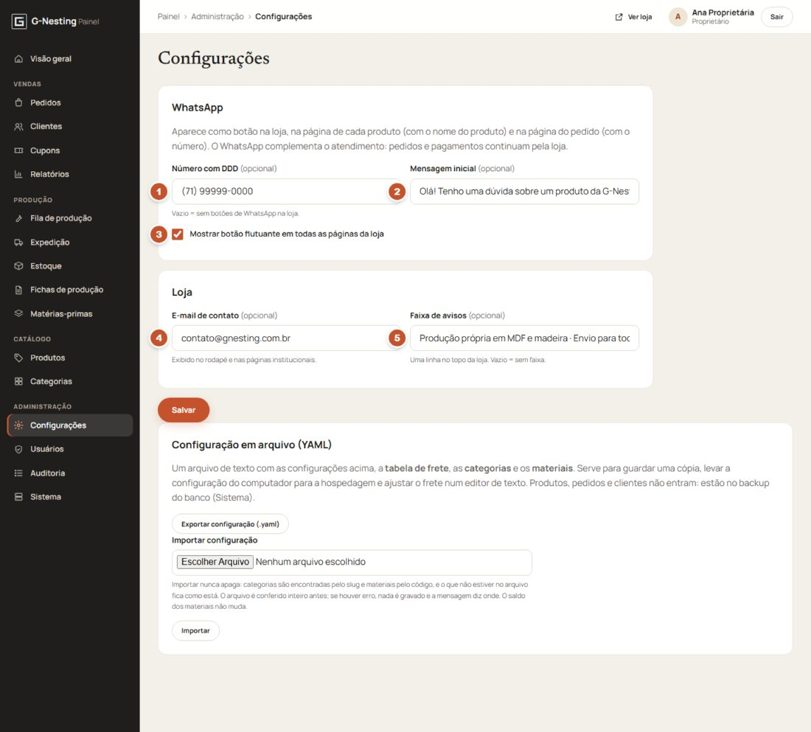

## 22.1 WhatsApp e loja

| Nº | Campo | Para que serve e quando usar | Como preencher (exemplo) | Cuidados |
|---|---|---|---|---|
| 1 | **Número com DDD** (opcional) | ativa os botões de WhatsApp: na página de cada produto, na página do pedido e, se marcado, o botão flutuante | (71) 99999-0000 | vazio = sem botões de WhatsApp na loja |
| 2 | **Mensagem inicial** (opcional) | texto que já vem escrito ao abrir a conversa | "Olá! Tenho uma dúvida sobre um produto da G-Nesting." | na página do produto e do pedido, o nome do produto ou o número do pedido entra na mensagem |
| 3 | **Mostrar botão flutuante em todas as páginas da loja** | o botão verde no canto da tela | marcado | — |
| 4 | **E-mail de contato** (opcional) | aparece no rodapé e nas páginas institucionais | contato@sualoja.com.br | é o e-mail para onde os clientes escrevem |
| 5 | **Faixa de avisos** (opcional) | a linha no topo da loja | "Frete grátis acima de R$ 300 · Use o cupom BEMVINDO" | até 140 caracteres; vazio = sem faixa |

Clique em **Salvar**.

> **OBSERVAÇÃO:** "O WhatsApp complementa o atendimento: pedidos e pagamentos continuam pela loja."

## 22.2 Configuração em arquivo (YAML) e tabela de frete

O bloco **Configuração em arquivo (YAML)** exporta e importa, num arquivo de texto, as configurações acima, a **tabela de frete**, as **categorias** e os **materiais**. Serve para:

- guardar uma cópia das configurações;
- levar a configuração de uma instalação para outra (do computador para a hospedagem);
- **alterar a tabela de frete**, que não tem tela própria no painel.

"Produtos, pedidos e clientes não entram: estão no backup do banco (Sistema)."

**Como alterar a tabela de frete:**

1. Clique em **Exportar configuração (.yaml)** e salve o arquivo.
2. Abra o arquivo num editor de texto simples (Bloco de Notas, por exemplo).
3. Altere a parte `frete` (exemplo abaixo). Valores em reais com **ponto** decimal (19.90).
4. Salve o arquivo.
5. Em **Importar configuração**, escolha o arquivo e clique em **Importar**.

```
frete:
  uf_origem: BA                  # estado de onde a loja envia
  frete_gratis_acima: null       # ex.: 300.00 = frete grátis acima de R$ 300; null = desligado
  servico_frete_gratis: economico
  retirada:
    ativa: false                 # true = oferece "Retirada no ateliê"
    rotulo: 'Retirada no ateliê'
    dias: 0
  tabela:
    local:                       # mesmo estado da origem
      economico:
        ate_1kg: 19.9            # preço até 1 kg
        por_kg_adicional: 4.0    # acréscimo por kg acima de 1 kg
        prazo_dias: 4            # dias úteis após a produção
      expresso:
        ate_1kg: 29.9
        por_kg_adicional: 7.0
        prazo_dias: 2
    'N':                         # região Norte (depois NE, CO, SE e S)
      economico: ...
```

As faixas são: `local` (mesmo estado da loja) e as regiões de destino `N`, `NE`, `CO`, `SE` e `S`. Os serviços são `economico` (aparece como **Econômico (PAC)**) e `expresso` (**Expresso (SEDEX)**).

Exemplo de cálculo: para um pacote de 2,4 kg ao Nordeste no econômico, com `ate_1kg: 24.9` e `por_kg_adicional: 5.0`, o frete é 24,90 + 2 × 5,00 = **R$ 34,90** (acima de 1 kg, cada kg ou fração conta).

> **IMPORTANTE:** "Importar nunca apaga: categorias são encontradas pelo slug e materiais pelo código, e o que não estiver no arquivo fica como está. O arquivo é conferido inteiro antes; se houver erro, nada é gravado e a mensagem diz onde. O saldo dos materiais não muda."

> **ATENÇÃO:** no arquivo YAML, os espaços no começo das linhas fazem parte do formato. Mantenha o mesmo alinhamento do arquivo exportado e não use a tecla Tab.

---

# 23. Sistema e auditoria

**Perfil:** PROPRIETÁRIO

## 23.1 Sistema

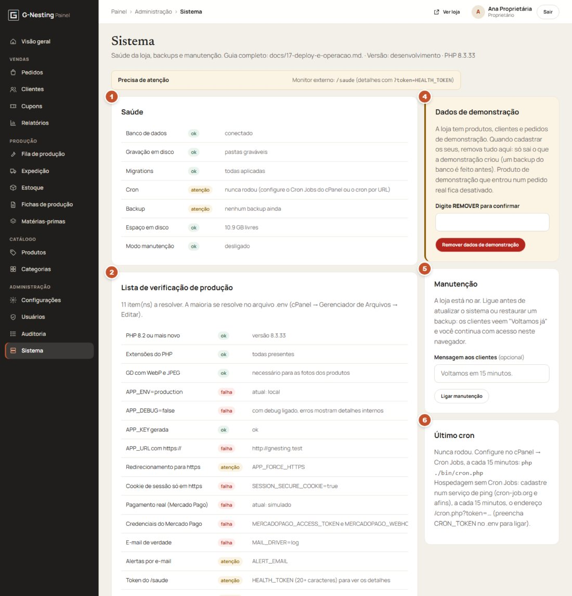

1. **Saúde**: banco de dados, gravação em disco, atualizações do banco (migrations), cron, backup, espaço em disco e modo manutenção. Cada item mostra **ok**, **atenção** ou **falha**, com o detalhe.
2. **Lista de verificação de produção**: o que ainda precisa ser configurado para a loja funcionar de verdade na internet (https, pagamento real, e-mail real, etc.). A maioria se resolve no arquivo de configuração da hospedagem, como explica o *Guia de instalação e uso*.
3. **Backups** (mais abaixo na página): **Fazer backup agora**, lista de backups com **Baixar** (banco e arquivos) e **Restaurar…**.
4. **Dados de demonstração**: remove os produtos, clientes e pedidos de exemplo (seção 23.3).
5. **Manutenção**: tira a loja do ar temporariamente.
6. **Último cron**: quando as tarefas automáticas rodaram pela última vez.

A página mostra também, no topo, **Atualização do banco de dados pendente**, quando uma versão nova do sistema precisa alterar o banco. Clique em **Atualizar banco de dados**: um backup é feito antes, automaticamente.

**Backups:**

- O sistema faz **um backup por dia** sozinho (pelo cron). **Fazer backup agora** cria um na hora.
- Cada backup tem duas partes: **banco** (produtos, pedidos, clientes, configurações) e **arquivos** (fotos e arquivos de produção).
- "Baixe uma cópia ao menos uma vez por semana e guarde fora do servidor, em local protegido: os arquivos têm dados pessoais de clientes."

**Restaurar um backup:**

1. Ligue a **Manutenção**.
2. No backup desejado, clique em **Restaurar…**.
3. Marque **Restaurar também fotos e arquivos de produção**, se quiser.
4. Digite **RESTAURAR** para confirmar e clique em **Restaurar este backup**.

> **ATENÇÃO:** restaurar "substitui **todo o banco atual** por este backup". Tudo o que aconteceu depois do backup (pedidos, cadastros) se perde. O sistema guarda antes uma cópia do estado atual.

**Manutenção:**

1. Escreva, se quiser, a **Mensagem aos clientes** (ex.: "Voltamos em 15 minutos.").
2. Clique em **Ligar manutenção**. Os clientes veem a página "Voltamos já"; você continua com acesso neste navegador.
3. Ao terminar, clique em **Desligar e voltar ao ar**.

> **IMPORTANTE:** as tarefas automáticas (cancelar pedidos não pagos em 48 h, limpar carrinhos vencidos, apagar links de senha vencidos, fazer o backup diário e apagar arquivos técnicos de registro antigos; a auditoria não é apagada) dependem do **cron**. Se **Último cron** mostrar "Nunca rodou" ou uma data antiga, avise quem cuida da hospedagem.

## 23.2 Auditoria

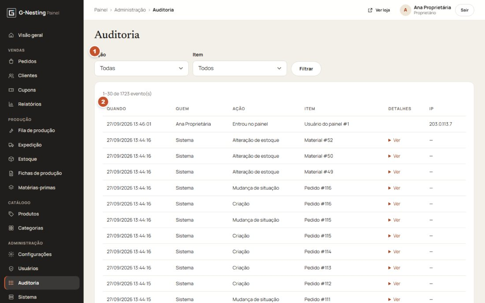

1. **Filtros**: **Ação** (entrada no painel, criação, alteração, exclusão, mudança de situação, alteração de estoque, exportação…) e **Item** (pedido, produto, usuário, material…).
2. **Registro**: **Quando**, **Quem** (pessoa ou "Sistema"), **Ação**, **Item**, **Detalhes** (**Ver** mostra os valores **Antes** e **Depois**) e **IP**.

A auditoria não pode ser editada nem apagada pela tela. Use-a para descobrir quem mudou um preço, cancelou um pedido ou acertou um estoque.

## 23.3 Remover os dados de demonstração

A loja pode ser instalada com dados de exemplo, para conhecer o sistema. Quando for cadastrar os seus produtos:

1. Em **Sistema**, no bloco **Dados de demonstração**, digite **REMOVER**.
2. Clique em **Remover dados de demonstração**.

"Só sai o que a demonstração criou (um backup do banco é feito antes). Produto de demonstração que entrou num pedido real fica desativado."

---

# 24. Notificações e mensagens

## 24.1 E-mails automáticos para o cliente

| Quando | Assunto | Conteúdo |
|---|---|---|
| Pedido registrado | Pedido GN-… recebido | resumo e o link para acompanhar e pagar |
| Pagamento aprovado | Pagamento aprovado — pedido GN-… | "O pagamento foi confirmado e o seu pedido entrou na fila de produção. Ele fica pronto em até N dias úteis…" |
| Produção começou | Seu pedido GN-… está em produção | "Começamos a produzir o seu pedido…" |
| Pedido enviado | Pedido GN-… enviado | transportadora e código de rastreio |
| Pedido entregue | Pedido GN-… entregue | "Esperamos que você goste! Se algo não estiver perfeito, responda este e-mail." |
| Pedido cancelado | Pedido GN-… cancelado | o motivo informado |
| Mensagem da equipe | Mensagem sobre o pedido GN-… | o texto escrito no painel |
| Reenvio do link | Link do pedido GN-… | o link de acompanhamento |
| Esqueci minha senha | Redefinição de senha — G-Nesting | link válido por 60 minutos |

Os e-mails de pedido trazem o link para a página do pedido.

> **OBSERVAÇÃO:** o sistema **não envia e-mail para a loja** a cada venda. Acompanhe as vendas pela **Visão geral** e por **Pedidos** (o aplicativo do painel no celular ajuda). E-mails para a equipe só existem para **alertas técnicos** (erro no sistema, falha do cron ou do backup), enviados ao endereço de alerta definido na instalação.

## 24.2 Mensagens na loja

- **Faixas de confirmação e erro** depois de cada ação ("Produto adicionado ao carrinho.", "Cupom aplicado: …").
- **Mensagens da G-Nesting** na página do pedido: o que a equipe enviou pelo painel.
- **WhatsApp**: botões para o cliente falar com a loja (seção 22.1). O sistema não envia mensagens de WhatsApp sozinho.

## 24.3 Mensagens no painel

- **Nota interna** no pedido: só a equipe vê (seção 18.5).
- **Observações da equipe** na ficha do cliente (seção 17.2).
- **Observação** ao avançar uma ordem de produção: vai para o histórico da ordem (seção 15.3).
- **Precisa de atenção** na Visão geral: alertas de estoque, pagamentos parados e produtos sem foto (capítulo 11).

---

# 25. Procedimentos operacionais

Passo a passo das tarefas mais comuns, do começo ao fim. Cada procedimento remete aos capítulos com os detalhes.

## 25.1 Colocar a loja em operação (primeira vez)

**Perfil:** PROPRIETÁRIO

1. Entre no painel com o usuário criado na instalação.
2. Em **Configurações**, preencha WhatsApp, **E-mail de contato** e, se quiser, a **Faixa de avisos** (22.1).
3. Confira a tabela de frete: exporte o YAML, ajuste a parte `frete` e importe (22.2).
4. Em **Usuários**, crie os usuários da equipe com o perfil certo (20.1).
5. Em **Sistema**, confira a **Lista de verificação de produção**: tudo deve estar **ok** antes de vender (23.1).
6. Cadastre categorias (12), matérias-primas (14.2) e produtos (25.2).
7. Faça uma compra de teste de valor baixo, pague e acompanhe até o envio.
8. Quando os seus produtos estiverem prontos, **remova os dados de demonstração** (23.3).

## 25.2 Cadastrar um produto completo

**Perfil:** PROPRIETÁRIO · GESTOR (ficha de produção: também PRODUÇÃO)

1. **Produtos → Novo produto**: nome, categoria, resumo, descrição, características (13.4).
2. **Comercial**: preço, custo e SKU (13.5).
3. **Estoque e envio**: modo, prazos e embalagem com peso (13.6).
4. **SEO**: título, descrição e palavras-chave (13.7).
5. **Criar produto**.
6. **Variações**, se houver: opções → **Gerar variações** → editar preço, custo e medidas de cada uma (13.8).
7. **Imagens**: envie as fotos, escolha a capa, preencha as descrições (13.9).
8. **Personalização**, se houver: um campo por informação que o cliente preenche (13.10).
9. **Produção**: preencha a ficha de **cada variação** (material, corte, peças por chapa, etapas e tempos, arquivos CNC) (15.1). Use **Copiar ficha** entre variações parecidas.
10. Confira em **Fichas de produção** que todas as variações estão **Completa**.
11. **Ativar produto** e **Ver na loja** para conferir como ficou.

## 25.3 Atender um pedido do começo ao fim

| Etapa | Quem | Onde | O que fazer |
|---|---|---|---|
| 1. Pedido chega | — | automático | o cliente paga; o pedido vai para **Produção pendente** e para a fila |
| 2. Conferir | gestor / atendimento | **Pedidos** | abrir o pedido, conferir personalização e endereço; registrar nota se precisar |
| 3. Produzir | produção | **Fila de produção** | **Assumir**, imprimir a ordem, avançar etapa por etapa (15.2 a 15.4) |
| 4. Controle de qualidade | produção | fila | **Aprovar → Embalagem** ou **Reprovar…** com motivo |
| 5. Embalar | produção | fila | **Concluir → Pronto**. O pedido fica **Pronto para envio** |
| 6. Despachar | produção / gestor | **Expedição** | imprimir o romaneio, conferir, gerar a etiqueta na transportadora, informar o rastreio e **Despachar** (16) |
| 7. Entregar | produção / gestor | **Expedição** | **Marcar entregue** quando o rastreio confirmar |

## 25.4 Rotina diária

**Perfil:** PROPRIETÁRIO · GESTOR · PRODUÇÃO

1. **Visão geral**: olhe **Precisa de atenção** e **Pedidos por etapa**.
2. **Fila de produção**: ataque primeiro os **Atrasados** e os **Em risco**.
3. **Expedição**: despache tudo o que está em **Prontos para envio**.
4. **Em trânsito**: marque como entregue o que o rastreio já confirmou.
5. **Pedidos → Aguardando pagamento**: pedidos com mais de um dia podem pedir um contato com o cliente (**Reenviar link do pedido** ou WhatsApp).

## 25.5 Rotina semanal e mensal

- **Semanal:** baixar uma cópia do backup e guardar fora do servidor (23.1); conferir **Matérias-primas** com **Repor** e registrar as compras (14.2); fazer o acerto de contagem das peças de pronta entrega (14.1).
- **Mensal:** **Relatórios** do mês anterior (vendas, produtos, margem, produção); revisar cupons **Vencidos** e **Esgotados**; revisar usuários da equipe e desativar quem saiu (20.1); desmarcar **Lançamento** de produtos que já não são novidade.

## 25.6 Registrar a compra de matéria-prima

**Perfil:** PROPRIETÁRIO · GESTOR · PRODUÇÃO

1. **Matérias-primas** → **Editar** no material (ou **Estoque → Matéria-prima → Entrada ou saída**).
2. **Movimentar saldo** → **Entrada (compra)**, quantidade e motivo com o número da nota ("Compra NF 123").
3. **Registrar**.
4. Se o preço mudou, atualize o **Custo por unidade** e clique em **Salvar alterações**.

## 25.7 Criar uma campanha com cupom

**Perfil:** PROPRIETÁRIO · GESTOR

1. **Cupons → Novo cupom**: código curto, tipo, valor, compra mínima.
2. Defina **Início** e **Fim** da campanha e, se quiser, **Limite de usos** e **Usos por cliente**.
3. Se quiser, divulgue na **Faixa de avisos** (**Configurações**).
4. Acompanhe em **Cupons** (usos e descontos dados) e em **Relatórios → Vendas** (descontos).

## 25.8 Cancelar um pedido a pedido do cliente

**Perfil:** PROPRIETÁRIO · GESTOR

1. Abra o pedido e confira a situação: pedidos **Enviados** ou **Entregues** não podem ser cancelados (trate como devolução, fora do sistema).
2. Se a peça personalizada já está em produção, combine com o cliente antes (seção 8.4).
3. **Cancelar pedido**, com o **Motivo** e, se pago, **Estornar agora pelo provedor de pagamento** (18.4).
4. Confira em **Pagamento** que o estorno aparece como **Estornado**.

## 25.9 Tirar uma pessoa da equipe

**Perfil:** PROPRIETÁRIO

1. **Usuários** → **Editar** na pessoa.
2. Desmarque **Acesso ativo** e salve. O histórico dela continua na auditoria.

---

# 26. Solução de problemas

## 26.1 Para o cliente

| Problema | O que fazer |
|---|---|
| Não recebi o e-mail do pedido | Confira a caixa de spam e se o e-mail digitado estava certo. Peça ao atendimento para **reenviar o link do pedido** |
| O pagamento foi recusado | Na página do pedido, **Pagar agora** e tente outro meio (Pix costuma ser o mais simples) |
| Paguei, mas o pedido continua "Aguardando pagamento" | Pix é confirmado em minutos; boleto, em até 3 dias úteis. Se passar disso, fale com a loja informando o número do pedido |
| O produto não entra no carrinho | Leia a mensagem embaixo do campo: personalização obrigatória em branco, texto fora do limite, quantidade acima do disponível ou produto esgotado |
| O cupom não funciona | Veja a mensagem (tabela da seção 6.2): código, validade, compra mínima ou limite de usos |
| Não aparecem opções de frete | Confira o CEP e clique em **Calcular frete**. Se aparecer "Não entregamos neste CEP…", fale com a loja |
| "E-mail ou senha inválidos." | Confira o e-mail; se esqueceu a senha, use **Esqueci minha senha** |
| "Muitas tentativas. Tente novamente em X minutos." | Espere o tempo indicado |
| "Este link de redefinição é inválido ou já expirou. Peça um novo." | O link vale 60 minutos e uma única vez. Peça outro em **Esqueci minha senha** |
| Meu pedido não aparece em "Meus pedidos" | Ele foi feito sem entrar na conta. Acompanhe pelo link do e-mail |
| Não aparece o botão para instalar o aplicativo | Use o menu do navegador (**Instalar app** / **Adicionar à tela inicial**). No iPhone, só pelo Safari: **Compartilhar → Adicionar à Tela de Início** |
| A página ficou com o visual estranho depois de uma atualização da loja | Recarregue com **Ctrl+F5** (no celular, limpe o cache do navegador ou abra numa aba anônima) |

## 26.2 Para a equipe

| Problema | Causa provável | O que fazer |
|---|---|---|
| "Para ativar o produto, falta: …" | falta imagem, preço ou categoria ativa | complete o que a mensagem diz (13.3) |
| Produto ativo não aparece na loja | categoria (ou a principal dela) inativa; variação padrão inativa | ative a categoria; confira a variação padrão em **Variações** |
| "Acesso negado" | a página não é do seu perfil | peça ao proprietário (20.2) |
| Pedido pago continua "Aguardando pagamento" | o Mercado Pago ainda não confirmou ao sistema | confira no painel do Mercado Pago. O sistema não tem botão para marcar como pago |
| Não consigo mudar a situação do pedido para "Em produção" | as etapas de produção andam pela fila | avance a ordem na **Fila de produção** |
| "O pedido mudou de situação. Recarregue a página." | outra pessoa mexeu no pedido ao mesmo tempo | recarregue e confira antes de repetir |
| "O provedor de pagamento não confirmou o estorno. Nada foi cancelado." | falha no Mercado Pago | tente de novo, ou estorne no Mercado Pago e use **Já estornei por fora** |
| "Este produto é feito sob encomenda: a quantidade não é controlada." | acerto de estoque num produto sob pedido | mude o **Modo** para **Pronta entrega** no produto, se for o caso |
| "Informe o motivo do acerto…" | acerto de estoque sem motivo | preencha o **Motivo** |
| A matéria-prima não baixou depois do CNC | a ficha não tem **Material** ou **Peças por chapa** | complete a ficha de produção |
| A ordem foi direto para o controle de qualidade | a variação não tem ficha de produção | preencha a ficha (15.1) |
| Categoria não pode ser excluída | tem produtos ou subcategorias | mova-os antes, ou apenas desative (12.2) |
| Cupom não pode ser excluído | já foi usado | desmarque **Ativo** |
| Não consigo desativar a minha conta / mudar o meu papel | regra de segurança | outro proprietário faz isso |
| Os clientes não recebem e-mails | envio de e-mail não configurado | em **Sistema**, veja o item **E-mail de verdade** da lista de verificação; é configuração da hospedagem (*Guia de instalação e uso*) |
| Pedidos não pagos não são cancelados após 48 h | o cron não está rodando | veja **Último cron** em **Sistema** (23.1) |
| "Muitas tentativas" no login do painel | 5 erros em 15 minutos | espere ou use **Esqueci minha senha** |
| A importação do YAML deu erro | formato do arquivo | a mensagem diz a linha; nada foi gravado. Corrija o alinhamento e tente de novo (22.2) |
| Botão **Instalar o painel no celular** não aparece | site sem https ou navegador sem suporte | use o menu do navegador; confira o https |

---

# 27. Boas práticas

**Catálogo**

- Preencha o **Custo unitário** de todas as variações: sem ele, margens e relatórios ficam incompletos.
- Use um padrão de **SKU** (ex.: tipo-modelo-tamanho-material-acabamento, como `POR-CHV-5-MDF3-NAT`). O SKU é permanente.
- Fotos com fundo neutro e luz natural, pelo menos 1600 px, com descrição em cada uma.
- Não altere o **endereço (slug)** de produtos e categorias já divulgados.
- Pese o produto embalado e preencha **Peso total** da embalagem: é o que define o frete.
- Mantenha as **fichas de produção completas** antes de ativar o produto.

**Vendas e atendimento**

- Registre tudo o que foi combinado com o cliente como **nota interna** no pedido.
- Use **Mensagem ao cliente** para avisos sobre o pedido: fica registrada e aparece na página do pedido.
- Confirme a identidade antes de exportar ou anonimizar dados de um cliente.

**Produção**

- **Assuma** a ordem antes de começar, para a equipe saber quem está com ela.
- Avance a ordem **quando a etapa termina**, não depois: os prazos e o relatório de produção dependem disso.
- Na personalização, confira **letra por letra** antes de gravar.
- Ao reprovar no controle de qualidade, escreva um motivo claro: ele ajuda a evitar o mesmo erro.

**Segurança**

- Cada pessoa com o próprio usuário; nunca compartilhe senhas.
- Dê o menor perfil suficiente; desative quem sai da equipe no mesmo dia.
- Senhas do painel longas (12 caracteres ou mais) e diferentes de outros sites.
- Baixe o backup toda semana e guarde fora do servidor, em local protegido.
- Ligue a **Manutenção** antes de restaurar backups ou atualizar o sistema.

---

# 28. Glossário

| Termo | Significado |
|---|---|
| Acabamento | etapa de pintura, verniz ou selagem; também a opção de cor/verniz de um produto |
| Aplicativo (PWA) | a loja ou o painel instalados no celular, com ícone próprio |
| Assumir | colocar uma ordem de produção no seu nome |
| Auditoria | registro de quem fez o quê e quando no painel |
| Backup | cópia de segurança do banco e dos arquivos |
| Capa | a foto principal do produto |
| Carga na fila | soma das horas de trabalho das ordens ainda não prontas |
| Checkout | finalização da compra (entrega, dados e pagamento) |
| CNC | máquina de corte controlada por computador (fresadora); primeira etapa da produção |
| Controle de qualidade (CQ) | conferência final da peça; pode aprovar ou mandar para retrabalho |
| Cron | tarefas automáticas que o servidor executa de tempos em tempos |
| CSV | arquivo de planilha, aberto no Excel |
| Cupom | código de desconto |
| Estorno | devolução do valor pago |
| Expedição | despacho dos pedidos para a transportadora |
| Ficha de produção | documento técnico da variação: material, corte, programa CNC, etapas, tempos e arquivos |
| Fila de produção | lista das ordens de produção em andamento |
| LGPD | Lei Geral de Proteção de Dados (Lei 13.709/2018) |
| Manutenção | modo que tira a loja do ar temporariamente |
| Margem | percentual do preço que sobra depois do custo |
| Matéria-prima | material usado na produção (chapas, ferragens, embalagens) |
| Nesting | técnica de encaixar as peças numa chapa para aproveitar o material; origem do nome G-Nesting |
| Ordem de produção | cada item de pedido pago, na fila da oficina |
| Personalização | informação que o cliente escolhe ou escreve para a peça (nome, inicial, data, opção) |
| Preço "de" | preço antigo, riscado, que indica promoção |
| Pronta entrega | modo em que a peça já está pronta e o estoque é controlado |
| Retrabalho | peça reprovada que volta para uma etapa anterior |
| Romaneio | folha de conferência do pacote, com destinatário e itens |
| Sob pedido (sob encomenda) | modo em que a peça só é feita depois do pagamento |
| SEO | ajustes para o produto aparecer bem no Google |
| SKU | código único de cada versão de produto |
| Slug | parte final do endereço de uma página (`/produto/porta-chaves-minimalista`) |
| Ticket médio | faturamento dividido pelo número de pedidos pagos |
| Variação | cada versão de um produto (ex.: MDF 6 mm / Pintado), com SKU, preço e estoque próprios |
| Variação padrão | a versão que aparece selecionada na loja |
| YAML | formato de arquivo de texto usado para exportar e importar configurações |

---

# 29. Perguntas frequentes

## 29.1 Clientes

**Preciso criar conta para comprar?**
Não. Basta informar o e-mail na finalização. A conta serve para ver todos os pedidos, usar favoritos e salvar endereços.

**Quais formas de pagamento posso usar?**
Pix, cartão e boleto, no ambiente do Mercado Pago.

**Quanto tempo demora para o pedido chegar?**
Prazo de produção (na página do produto, em dias úteis, contado a partir do pagamento) + prazo de entrega do frete escolhido.

**Como acompanho meu pedido?**
Pelo link do e-mail de confirmação ou em **Minha conta → Meus pedidos**, se comprou com a conta.

**Posso cancelar meu pedido?**
Não pela loja. Fale com o atendimento com o número do pedido.

**Posso mudar o texto da personalização depois de comprar?**
Não pela loja. Fale com o atendimento o quanto antes: depois que a peça é gravada, não é possível mudar.

**Como troco minha senha?**
Por **Esqueci minha senha**, na tela **Entrar**.

**Como mudo meu endereço ou meu e-mail?**
O endereço é informado a cada compra (**Usar outro endereço**). Para mudar o e-mail da conta, fale com a loja.

**Posso usar dois cupons na mesma compra?**
Não. Um cupom por compra.

**Meu pedido não pago foi cancelado. Por quê?**
Pedidos não pagos em 48 horas são cancelados automaticamente. Faça um novo pedido.

**Como peço a exclusão dos meus dados?**
Pelo e-mail de contato, a partir do e-mail cadastrado, conforme a **Política de privacidade**.

## 29.2 Equipe e proprietário

**Como marco um pedido como pago?**
Não é feito à mão: o pedido é liberado quando o Mercado Pago confirma o pagamento.

**Por que não consigo mudar a situação do pedido para "Em produção"?**
Porque as etapas de produção são controladas pela **Fila de produção**. O pedido acompanha a ordem.

**Como faço uma promoção?**
Preencha o **Preço "de"** do produto (maior que o preço de venda): ele aparece riscado, com o selo de desconto, e entra em **Ofertas**. Ou crie um cupom.

**Como altero o valor do frete?**
Pela configuração em arquivo (YAML), na parte `frete` (22.2).

**Como ofereço frete grátis?**
Com um cupom do tipo **Frete grátis**, ou com `frete_gratis_acima` na configuração em arquivo.

**Posso excluir um usuário do painel?**
Não; desative-o (**Acesso ativo**). O histórico continua.

**Por que a categoria não tem foto?**
A foto vem da capa do produto mais vendido da categoria. Não há envio de foto para categoria.

**A equipe de produção pode ver o valor dos pedidos?**
Sim, pode consultar os pedidos, mas não cancela nem envia mensagens ao cliente.

**Quem vê o CPF do cliente?**
Proprietário e gestor veem completo; atendimento vê parcial. A equipe de produção vê o CPF no romaneio, para o transporte.

**Recebo aviso de nova venda?**
Não por e-mail. Acompanhe pela Visão geral e por Pedidos; o aplicativo do painel no celular facilita.

**Como recupero algo apagado por engano?**
Restaurando um backup de antes do problema (23.1), sabendo que o que aconteceu depois do backup se perde. Na dúvida, fale com quem cuida da hospedagem antes de restaurar.

**Esqueci a senha do painel.**
Use **Esqueci minha senha** no login do painel. Se nenhum proprietário conseguir entrar, quem cuida da hospedagem pode criar um novo usuário, como explica o *Guia de instalação e uso*.

---

# 30. Fluxos do sistema

## 30.1 Fluxo de compra (cliente)

```
Loja → Produto → (variação + personalização + quantidade) → Adicionar ao carrinho
  → Carrinho (cupom) → Finalizar compra
  → Seus dados + Entrega + Frete → Ir para o pagamento
  → Pedido registrado (Aguardando pagamento) + e-mail "Pedido recebido"
  → Mercado Pago (Pix, cartão ou boleto) → volta para a página do pedido
```

## 30.2 Fluxo do pedido (situações)

```
Aguardando pagamento ──(Mercado Pago confirma)──► Pagamento aprovado
        │                                               │ (automático)
        │ 48 h sem pagar                                ▼
        ▼                                        Produção pendente (Na fila)
    Cancelado ◄──(gestor, até "Pronto para envio")──┤
                                                        ▼  fila de produção
                              Em produção → Acabamento → Controle de qualidade
                                     ▲                          │
                                     └──── retrabalho ──────────┤
                                                                ▼
                                                  Embalagem → Pronto para envio
                                                                │ Despachar
                                                                ▼
                                                            Enviado
                                                                │ Marcar entregue
                                                                ▼
                                                            Entregue
```

## 30.3 Fluxo de produção (uma ordem)

```
Na fila → [Iniciar CNC] → CNC → [Concluir] → Lixamento → Pintura / acabamento
  → Secagem → Montagem → Controle de qualidade ─[Aprovar]→ Embalagem → [Concluir] → Pronto
                                  │
                                  └─[Reprovar: voltar para uma etapa anterior + motivo]
```

Só entram as etapas da ficha (CQ e Embalagem sempre). Ao sair do CNC, a matéria-prima é baixada.

## 30.4 Fluxo de estoque de pronta entrega

```
Pedido feito ──► reserva (Reservado aumenta)
  ├─ pagamento aprovado ──► baixa (a contagem diminui, a reserva é consumida)
  └─ cancelado / 48 h sem pagar ──► reserva liberada (volta a ficar disponível)
Pedido pago cancelado ──► as peças voltam ao estoque
```

## 30.5 Fluxo de cadastro de produto

```
Novo produto (inativo) → Comercial → Estoque e envio → SEO → Criar produto
  → Variações (opções → Gerar variações → editar) → Imagens (capa)
  → Personalização (se houver) → Ficha de produção de cada variação
  → Ativar produto (exige imagem, preço e categoria ativa) → Ver na loja
```

---

# 31. Mapa do sistema

## 31.1 Loja

| Página | Endereço | Perfil |
|---|---|---|
| Página inicial | `/` | todos |
| Todos os produtos | `/produtos` | todos |
| Ofertas | `/produtos?oferta=1` | todos |
| Novidades | `/produtos?ordem=novidades` | todos |
| Pronta entrega | `/produtos?pronta=1` | todos |
| Categoria | `/categoria/nome-da-categoria` | todos |
| Busca | `/busca?q=palavra` | todos |
| Produto | `/produto/nome-do-produto` | todos |
| Carrinho | `/carrinho` | todos |
| Finalização da compra | `/checkout` | todos |
| Página do pedido | `/pedido/GN-AAAA-NNNNNN/confirmacao` | quem fez o pedido (link do e-mail ou conta) |
| Entrar / Criar conta | `/entrar`, `/cadastro` | visitante |
| Recuperar senha | `/recuperar-senha` | visitante |
| Minha conta | `/conta` | cliente |
| Meus pedidos | `/conta/pedidos` | cliente |
| Favoritos | `/conta/favoritos` | cliente |
| Institucionais | `/sobre`, `/como-fazemos`, `/trocas-e-devolucoes`, `/privacidade`, `/termos` | todos |
| Sem conexão (aplicativo) | `/offline` | todos |

## 31.2 Painel

| Grupo | Tela | Endereço | Perfis |
|---|---|---|---|
| — | Login | `/admin/login` | equipe |
| — | Visão geral | `/admin` | todos do painel |
| Vendas | Pedidos | `/admin/pedidos` | proprietário, gestor, produção, atendimento |
| Vendas | Clientes | `/admin/clientes` | proprietário, gestor, atendimento |
| Vendas | Cupons | `/admin/cupons` | proprietário, gestor |
| Vendas | Relatórios | `/admin/relatorios` | proprietário, gestor |
| Produção | Fila de produção | `/admin/producao` | proprietário, gestor, produção |
| Produção | Expedição | `/admin/expedicao` | proprietário, gestor, produção |
| Produção | Estoque | `/admin/estoque` | proprietário, gestor, produção |
| Produção | Fichas de produção | `/admin/fichas` | proprietário, gestor, produção |
| Produção | Matérias-primas | `/admin/materiais` | proprietário, gestor, produção |
| Catálogo | Produtos | `/admin/produtos` | proprietário, gestor |
| Catálogo | Categorias | `/admin/categorias` | proprietário, gestor |
| Administração | Configurações | `/admin/configuracoes` | proprietário |
| Administração | Usuários | `/admin/usuarios` | proprietário |
| Administração | Auditoria | `/admin/logs` | proprietário |
| Administração | Sistema | `/admin/sistema` | proprietário |

Dentro do produto: `/admin/produtos/N/editar` (abas Geral, Comercial, Estoque e envio, SEO), `/variantes`, `/imagens`, `/personalizacao` e `/ficha-producao`.

---

# 32. Índice remissivo

| Assunto | Seção |
|---|---|
| Acerto de contagem (estoque) | 14.1 |
| Aplicativo no celular (loja) | 4.8 |
| Aplicativo no celular (painel) | 10.3 |
| Área do cliente | 9 |
| Assumir ordem | 15.2, 15.4 |
| Ativar / desativar produto | 13.3, 13.13 |
| Atividade da equipe | 11, 20.2 |
| Auditoria | 23.2 |
| Backup | 23.1, 25.5 |
| Busca | 4.6 |
| Cadastro de cliente | 3.1 |
| Cancelamento de pedido | 8.4, 18.4, 25.8 |
| Carrinho | 6 |
| Categorias | 12 |
| Clientes | 17 |
| CNC (consumo de material) | 14.2, 15.4 |
| Configurações | 22 |
| Controle de qualidade | 15.2, 15.4 |
| CPF (quem vê) | 17.1, 20.2 |
| CSV | 21 |
| Cupons (cliente) | 6.2 |
| Cupons (painel) | 19 |
| Dados de demonstração | 1.3, 23.3 |
| Duplicar produto | 13.12 |
| E-mails automáticos | 24.1 |
| Endereços salvos | 7, 9.1 |
| Entrar (loja) | 3.2 |
| Entrar (painel) | 10.1 |
| Esqueci minha senha | 3.3, 10.1 |
| Estoque | 14 |
| Estorno | 18.4 |
| Excluir categoria | 12.2 |
| Excluir produto | 13.14 |
| Expedição | 16 |
| Faixa de avisos | 4.1, 22.1 |
| Favoritos | 4.5, 9 |
| Ficha de produção | 13.11, 15.1 |
| Fila de produção | 15.2 |
| Filtros da loja | 4.4 |
| Finalização da compra | 7 |
| Fluxos | 30 |
| Frete (cliente) | 7.1 |
| Frete (tabela) | 22.2 |
| Frete grátis | 19, 22.2 |
| Glossário | 28 |
| Imagens do produto | 13.9 |
| LGPD | 17.3 |
| Login bloqueado (muitas tentativas) | 3.2, 10.1 |
| Manutenção | 23.1 |
| Margem | 13.5, 21 |
| Matérias-primas | 14.2 |
| Mensagem ao cliente | 18.5, 24 |
| Menu do painel | 10.2 |
| Nota interna | 18.5 |
| Novidades | 4.1, 13.4 |
| Ofertas / preço "de" | 4.5, 13.5 |
| Ordem de produção impressa | 15.3 |
| Pagamento | 7.2 |
| Pedidos (cliente) | 8 |
| Pedidos (painel) | 18 |
| Perfis e permissões | 1.4, 2.4, 20.2 |
| Personalização (cliente) | 5.2 |
| Personalização (painel) | 13.10 |
| Prazo de produção | 13.6 |
| Produtos | 13 |
| Pronta entrega / sob pedido | 2.3, 13.6 |
| Relatórios | 21 |
| Retrabalho | 15.4 |
| Romaneio | 16 |
| Rotinas | 25.4, 25.5 |
| SEO | 12.1, 13.7 |
| Sistema | 23.1 |
| SKU | 13.5, 27 |
| Situações do pedido | 8.3, 18.3 |
| Solução de problemas | 26 |
| Usuários do painel | 20 |
| Variações | 13.8 |
| Visão geral | 11 |
| WhatsApp | 4.2, 22.1 |
| YAML | 22.2 |
